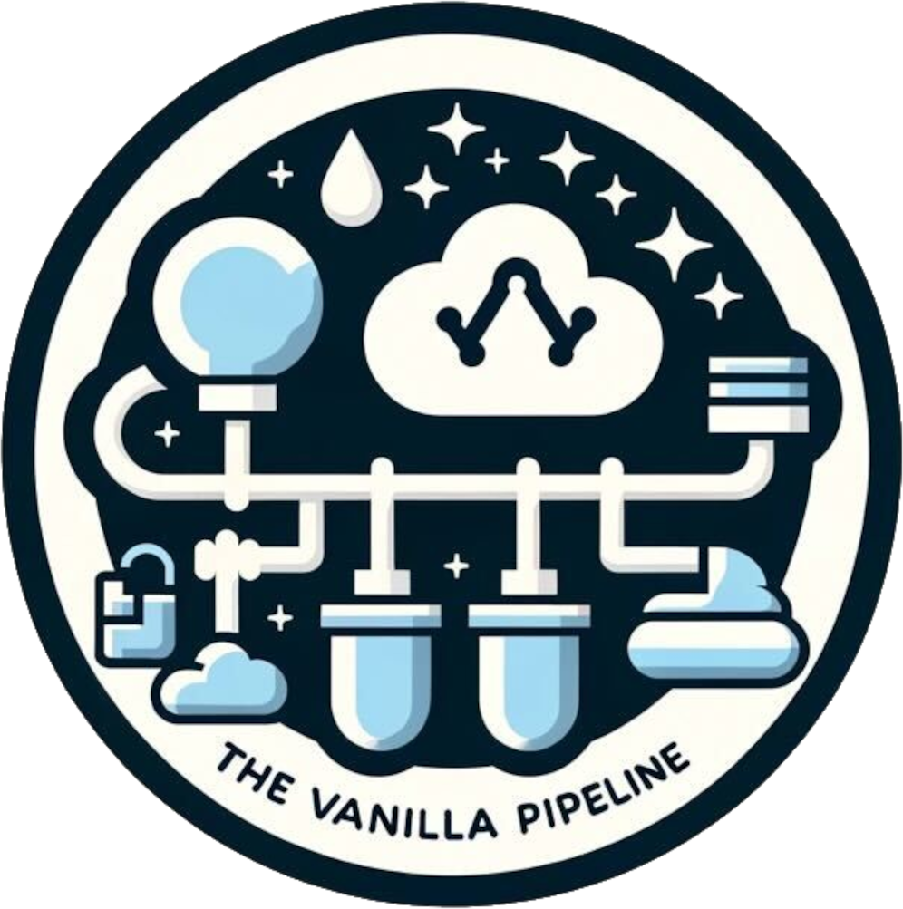

<p align="center">
  <a href="https://cdklabs.github.io/cdk-cicd-wrapper/">
    
    <h3 align="center">CDK CI/CD Wrapper</h3>
  </a>
</p>


<p align="center">
  <a href="https://cdklabs.github.io/cdk-cicd-wrapper/"><strong>Documentation</strong></a> ·
  <a href="https://github.com/cdklabs/cdk-cicd-wrapper/releases"><strong>Changelog</strong></a> ·
  <a href="#community"><strong>Join the community</strong></a>
</p>

<p align="center">
  <a href="https://opensource.org/licenses/Apache-2.0"></a>
  <a href="https://github.com/cdklabs/cdk-cicd-wrapper/actions/workflows/release.yml"></a>
  <a href="https://github.com/cdklabs/cdk-cicd-wrapper/commits/main"></a>
</p>

# Welcome to the CDK CI/CD Wrapper

The CDK CI/CD Wrapper gives you an easy way to deliver your CDK applications like a pro.
This repository contains all the tools to build, deliver and test any CDK Applications through multiple stages, and AWS accounts to have high level of quality and confidence.

## Project Structure

This repository is organized as a monorepo containing multiple packages and tools that work together to provide a comprehensive CI/CD solution:

### Core Packages

- **`packages/@cdklabs/cdk-cicd-wrapper`** - Main CDK constructs and pipeline blueprint library containing:
  - **Pipeline Stacks** - Core infrastructure components (EncryptionStack, PipelineStack, WorkbenchStack)
  - **Repository Stacks** - Version control integration (CodeCommitRepositoryStack, CodeStarConnectRepositoryStack, S3RepositoryStack)
  - **Supporting Stacks** - Additional infrastructure (SSMParameterStack, PostDeployExecutorStack, ComplianceBucketStack)
  - **VPC Stacks** - Network configuration options (ManagedVPCStack, NoVPCStack, VPCFromLookUpStack)
- **`packages/@cdklabs/cdk-cicd-wrapper-cli`** - Command-line interface for validation, security scanning, and project management
- **`packages/@cdklabs/cdk-cicd-wrapper-projen`** - Projen integration for project scaffolding and management

### Additional Components

- **`mcp-servers/debugger-mcp/`** - MCP (Model Context Protocol) server for AI-powered debugging assistance
- **`samples/`** - Example projects demonstrating CDK CI/CD Wrapper usage
  - `cdk-ts-example/` - TypeScript CDK example
  - `cdk-python-example/` - Python CDK example
- **`docs/`** - Documentation source files and build scripts
- **`projenrc/`** - Projen configuration files for managing project structure

### Development Workflow

The project uses:
- **Projen** for project management and code generation
- **Yarn workspaces** for monorepo dependency management
- **Jest** for testing across all packages
- **ESLint + Prettier** for code formatting and linting
- **Commitlint** for conventional commit enforcement

## Getting Started

To set up the CI/CD pipeline in your existing AWS CDK project, follow these steps:

### 1. Installation

Install the CDK CI/CD Wrapper pipeline package by running the following command:

```bash
npm i @cdklabs/cdk-cicd-wrapper @cdklabs/cdk-cicd-wrapper-cli
```

### 2. Basic Setup

Open your entry file, typically located at `bin/<your-main-file>.ts` (where `your-main-file` is the name of your root project directory).

Include the `PipelineBlueprint.builder().synth(app)` statement in your entry file:

```typescript
import * as cdk from 'aws-cdk-lib';
import { PipelineBlueprint } from '@cdklabs/cdk-cicd-wrapper';

const app = new cdk.App();

PipelineBlueprint.builder().synth(app);
```

This will deploy the CI/CD pipeline with its default configuration without deploying any stacks into the staging accounts.

### 3. Adding Your Application Stacks (Optional)

If you want to include additional stacks in the CI/CD pipeline, modify your entry file as follows:

```typescript
import * as cdk from 'aws-cdk-lib';
import { PipelineBlueprint, GlobalResources } from '@cdklabs/cdk-cicd-wrapper';

const app = new cdk.App();

PipelineBlueprint.builder().addStack({
provide: (context) => {
   // Create your stacks here
   new YourStack(context.scope, `${context.blueprintProps.applicationName}YourStack`, {
      applicationName: context.blueprintProps.applicationName,
      stageName: context.stage,
   });
   new YourOtherStack(context.scope, `${context.blueprintProps.applicationName}YourOtherStack`, {
      applicationQualifier: context.blueprintProps.applicationQualifier,
      encryptionKey: context.get(GlobalResources.ENCRYPTION)!.kmsKey,
   });
}}).synth(app);
```

**Note**: Refer to the [Developer Guide](https://cdklabs.github.io/cdk-cicd-wrapper/developer_guides/index.html) for more information on the `PipelineBlueprint`.

### 4. Required Scripts Configuration

The CDK CI/CD Wrapper expects to have the `validate`, `lint`, `test`, `audit` scripts defined. If you are missing any of the `npm run` scripts, or want to use the provided CLI tool for one or more actions, you can add the following definitions to your `package.json` file:

#### 4.1. Adding validate script
```bash
jq --arg key "validate" --arg val "cdk-cicd validate" '.scripts[$key] = $val' package.json | jq . > package.json.tmp; mv package.json.tmp package.json;
jq --arg key "validate:fix" --arg val "cdk-cicd validate --fix" '.scripts[$key] = $val' package.json | jq . > package.json.tmp; mv package.json.tmp package.json;
```

#### 4.2. Adding lint script
We recommend using eslint and you can initialize it:
```bash
npm init @eslint/config

jq --arg key "lint" --arg val "eslint . --ext .ts --max-warnings 0" '.scripts[$key] = $val' package.json | jq . > package.json.tmp; mv package.json.tmp package.json;
jq --arg key "lint:fix" --arg val "eslint . --ext .ts --fix" '.scripts[$key] = $val' package.json | jq . > package.json.tmp; mv package.json.tmp package.json;
```

#### 4.3. Adding audit scripts
```bash
npm install --save -D concurrently
jq --arg key "audit" --arg val "concurrently 'npm:audit:*(\!fix)'" '.scripts[$key] = $val' package.json | jq . > package.json.tmp; mv package.json.tmp package.json;
jq --arg key "audit:deps:nodejs" --arg val "cdk-cicd check-dependencies --npm" '.scripts[$key] = $val' package.json | jq . > package.json.tmp; mv package.json.tmp package.json;
jq --arg key "audit:deps:python" --arg val "cdk-cicd check-dependencies --python" '.scripts[$key] = $val' package.json | jq . > package.json.tmp; mv package.json.tmp package.json;
jq --arg key "audit:deps:security" --arg val "cdk-cicd security-scan --bandit --semgrep --shellcheck" '.scripts[$key] = $val' package.json | jq . > package.json.tmp; mv package.json.tmp package.json;
jq --arg key "audit:license" --arg val "npm run license" '.scripts[$key] = $val' package.json | jq . > package.json.tmp; mv package.json.tmp package.json;
jq --arg key "audit:fix:license" --arg val "npm run license:fix" '.scripts[$key] = $val' package.json | jq . > package.json.tmp; mv package.json.tmp package.json;
jq --arg key "license" --arg val "cdk-cicd license" '.scripts[$key] = $val' package.json | jq . > package.json.tmp; mv package.json.tmp package.json;
jq --arg key "license:fix" --arg val "cdk-cicd license --fix" '.scripts[$key] = $val' package.json | jq . > package.json.tmp; mv package.json.tmp package.json;
```

**Example package.json scripts section:**
```json
{
  ...
  "scripts": {
    "validate": "cdk-cicd validate",
    "validate:fix": "cdk-cicd validate --fix",
    "audit": "npx concurrently 'npm:audit:*(!fix)'",
    "audit:deps:nodejs": "cdk-cicd check-dependencies --npm",
    "audit:deps:python": "cdk-cicd check-dependencies --python",
    "audit:scan:security": "cdk-cicd security-scan --bandit --semgrep --shellcheck --ci",
    "audit:license": "npm run license",
    "audit:fix:license": "npm run license:fix",
    "license": "cdk-cicd license",
    "license:fix": "cdk-cicd license --fix",
    "lint": "eslint . --ext .ts --max-warnings 0",
    "lint:fix": "eslint . --ext .ts --fix",
    "test": "jest"
    ...
  }
  ...
}
```

**Note**: If you are using `eslint` for linting, ensure that the configuration files are present or generate them with `npm init @eslint/config`.

### 5. Pre-deployment Validation

Before deploying, run the following commands to ensure your project is ready:

```bash
npm run validate:fix
npm run audit:fix:license
```

- `npm run validate:fix` will create the required `package-verification.json` file for you.
- `npm run audit:fix:license` will generate a valid Notice file for you.

### 6. Deploy the CI/CD Pipeline

Deploy all the stacks by running the following command:

```bash
npx dotenv-cli -- npm run cdk deploy -- --all --region ${AWS_REGION} --profile $RES_ACCOUNT_AWS_PROFILE --qualifier ${CDK_QUALIFIER}
```

Once the command finishes, the following CDK Stacks will be deployed into your RES Account:

#### Core Infrastructure Stacks

- **EncryptionStack**: Creates and manages KMS keys for encrypting CloudWatch Log Groups and other AWS resources. Features automatic key rotation and proper service principal permissions.

- **PipelineStack**: The main orchestration stack that creates the CodePipeline with all CodeBuild steps, manages deployment stages, and coordinates the entire CI/CD workflow.

- **SSMParameterStack**: Creates and manages parameters in AWS Systems Manager Parameter Store, including account IDs, configuration values, and cross-stage references.

#### Repository Integration Stacks (One of the following based on your configuration)

- **CodeCommitRepositoryStack**: Sets up AWS CodeCommit repository with automated pull request workflows, CodeGuru scanning integration, and branch protection rules.

- **CodeStarConnectRepositoryStack**: Establishes secure connection between your AWS RES Account and external Git repositories (GitHub, Bitbucket, etc.) via AWS CodeStar connections.

- **S3RepositoryStack**: Configures S3-based artifact storage for scenarios where direct repository integration isn't suitable.

#### Optional Infrastructure Stacks

- **VPC Stacks** (deployed based on your networking configuration):
  - **ManagedVPCStack**: Creates a fully managed VPC with subnets, NAT gateways, and routing for isolated pipeline execution
  - **VPCFromLookUpStack**: Uses existing VPC infrastructure by looking up VPC resources in your account
  - **NoVPCStack**: Default configuration for pipelines that don't require VPC isolation

- **WorkbenchStack**: Provides isolated development and testing environment that allows developers to deploy and test stacks independently from the main CI/CD pipeline.

- **PostDeployExecutorStack**: Handles post-deployment actions such as integration tests, notifications, and cleanup tasks.

- **ComplianceBucketStack**: Creates S3 buckets and Lambda functions for compliance logging and audit trail management.

**Note**: VPC stacks are only created when specifically configured. Check the [networking documentation](https://cdklabs.github.io/cdk-cicd-wrapper/developer_guides/networking.html) for more information on networking configurations.

Visit our [documentation](https://cdklabs.github.io/cdk-cicd-wrapper/) to learn more.

## Use cases

The CDK CI/CD Wrapper is the next step on road to standardize and simplify the multi-stage CI/CD process that the successful [aws-cdk-cicd-boot-sample](https://github.com/aws-samples/aws-cdk-cicd-boot-sample) started. Thus the use cases for the CDK CI/CD Wrapper are the same as for the [aws-cdk-cicd-boot-sample](https://github.com/aws-samples/aws-cdk-cicd-boot-sample).

- Multi staged CI/CD pipeline for IaC projects

On top of that the CDK CI/CD Wrapper has arbitrary scripts that can be leveraged in any projects involving TypeScript, and/or Python.

- CI/CD execution by AWS CodePipeline in VPC, Private VPC with NAT Gateway, or even through an HTTP Proxy
- Security scanning on dependencies and on your project codebase as well
- License management over NPM and Python dependencies
- Support for private NPM registry to safely store your libraries
- Customizable CI/CD pipeline to attach to your CDK applications which comes with built-in dependency injection
- Workbench deployment feature which allows you to develop and experiment your solutions before it is introduced in the delivery pipeline, e.g: deploy and test one or multiple CDK stacks isolated from the ones deployed by the CI/CD pipeline

## Intended usage

You should not fork this repository and expect to reproduce the same in your AWS Accounts, this repository is only used for preparing, testing and shipping all the packages used by the CDK CI/CD Wrapper. Using the CDK CI/CD Wrapper gives you the following benefits:

- :white_check_mark: FOSS (Free and open-source software) scanning – built-in checks against a pre-defined adjustable list of licenses
- :white_check_mark: Workbench – isolated test environment for developers which enables parallel testing in the same AWS Account without collisions
- :white_check_mark: Automated security scanners – enabled by default bandit, shellcheck, npm audit, pip audit, etc)
- :white_check_mark: AWS CDK Language agnostic – support for TypeScript and Python, on the works to fully support Java / C# / Go 
- :white_check_mark: Built for many project types - facilitating MLOps usecase, Web App development (UIs), GenAI usecases

### MCP Debugger Server

The CDK CI/CD Wrapper includes a specialized **[MCP (Model Context Protocol)](https://modelcontextprotocol.io/) Debugger Server** that provides AI-powered debugging assistance for your CDK CI/CD Wrapper applications. This debugger server integrates seamlessly with MCP-compatible AI tools to help diagnose and resolve common configuration and deployment issues.

#### Compatible MCP Clients

The debugger server works with any [MCP-compatible client](https://modelcontextprotocol.io/clients), including:

- **[Amazon Q CLI](https://docs.aws.amazon.com/amazonq/latest/qdeveloper-ug/command-line.html)** - Amazon's AI-powered command-line assistant ([Installation Guide](https://docs.aws.amazon.com/amazonq/latest/qdeveloper-ug/command-line-getting-started-installing.html))
- **[Cline](https://cline.bot/)** - The Collaborative AI Coder. Experience an AI development partner that amplifies your engineering capabilities
- **Any other [MCP-compatible client](https://modelcontextprotocol.io/clients)** - The server follows the standard [MCP protocol specification](https://spec.modelcontextprotocol.io/)

### Key Features

The MCP Debugger Server offers six specialized debugging tools:

- **🔧 Comprehensive Configuration Analysis** - Validates all environment variables and configuration files to ensure proper setup
- **📊 Stage Definition Verification** - Checks that deployment stages are correctly defined with proper account mappings
- **🔗 Git Provider Configuration** - Validates GitHub/CodeCommit setup and tests connectivity
- **⚙️ CI/CD Configuration Analysis** - Analyzes CodePipeline or GitHub Actions configuration for proper setup
- **🔌 Plugin Security Analysis** - Identifies custom plugins and highlights potential security implications
- **🌐 VPC Configuration Validation** - Ensures VPC and networking configurations are properly set up

### Benefits

- **AI-Powered Troubleshooting** - Work with AI assistants to quickly identify and resolve configuration issues
- **Comprehensive Project Validation** - Run complete health checks on your CDK CI/CD Wrapper projects
- **Proactive Issue Detection** - Catch configuration problems before they cause deployment failures
- **Security Analysis** - Identify potentially unsafe plugin configurations and security risks
- **Environment Validation** - Ensure all required environment variables and AWS credentials are properly configured

### Getting Started with the Debugger

The MCP Debugger Server is located under `mcp-servers/debugger-mcp/` and can be used with any MCP-compatible clients as mentioned above. For detailed setup instructions, configuration examples, and usage guides, see the [MCP Debugger README](mcp-servers/debugger-mcp/README.md).

## Security

See [CONTRIBUTING](CONTRIBUTING.md#security-issue-notifications) for more information.

## License

This project is licensed under the Apache-2.0 License.

# Community

The CDK CI/CD Wrapper community can be found within the #cdk-cicd-wrapper channel in the [cdk.dev](https://cdk.dev/) community Slack workspace.

## Contributors

Thanks goes to these wonderful people ([emoji key](https://allcontributors.org/docs/en/emoji-key)):
<!-- ALL-CONTRIBUTORS-BADGE:START - Do not remove or modify this section -->
[](#contributors-)
<!-- ALL-CONTRIBUTORS-BADGE:END -->

<!-- ALL-CONTRIBUTORS-LIST:START - Do not remove or modify this section -->
<!-- prettier-ignore-start -->
<!-- markdownlint-disable -->
<table>
  <tbody>
    <tr>
      <td align="center" valign="top" width="14.28%"><a href="https://github.com/gmuslia"><br /><sub><b>Gezim Musliaj</b></sub></a><br /><a href="https://github.com/cdklabs/cdk-cicd-wrapper/commits?author=gmuslia" title="Code">💻</a></td>
      <td align="center" valign="top" width="14.28%"><a href="https://github.com/gyalai-aws"><br /><sub><b>Milan Gyalai @ AWS</b></sub></a><br /><a href="https://github.com/cdklabs/cdk-cicd-wrapper/commits?author=gyalai-aws" title="Code">💻</a></td>
      <td align="center" valign="top" width="14.28%"><a href="https://github.com/dainovsv"><br /><sub><b>Vladimir Dainovski</b></sub></a><br /><a href="https://github.com/cdklabs/cdk-cicd-wrapper/commits?author=dainovsv" title="Code">💻</a></td>
      <td align="center" valign="top" width="14.28%"><a href="https://github.com/thoulen"><br /><sub><b>Fabrizio Manfredi F.</b></sub></a><br /><a href="https://github.com/cdklabs/cdk-cicd-wrapper/commits?author=thoulen" title="Code">💻</a></td>
    </tr>
  </tbody>
</table>

<!-- markdownlint-restore -->
<!-- prettier-ignore-end -->

<!-- ALL-CONTRIBUTORS-LIST:END -->
