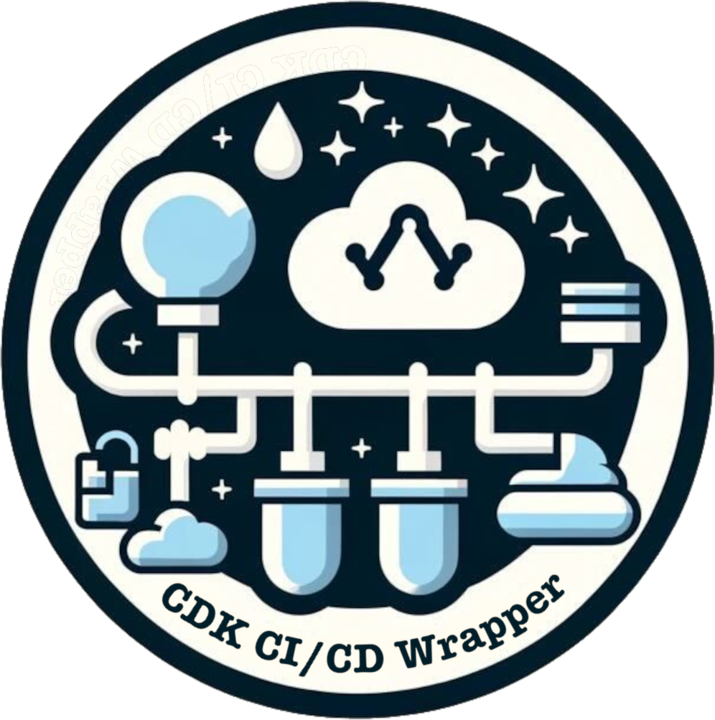

<p align="center">
  <a href="https://cdklabs.github.io/cdk-cicd-wrapper/">
    
    <h3 align="center">CDK CI/CD Wrapper</h3>
  </a>
</p>

<p align="center">
  <a href="https://cdklabs.github.io/cdk-cicd-wrapper/"><strong>Documentation</strong></a> ·
  <a href="https://github.com/cdklabs/cdk-cicd-wrapper/releases"><strong>Changelog</strong></a> ·
  <a href="#community"><strong>Join the community</strong></a>
</p>

<p align="center">
  <a href="https://opensource.org/licenses/Apache-2.0"></a>
  <a href="https://github.com/cdklabs/cdk-cicd-wrapper/actions/workflows/release.yml"></a>
  <a href="https://github.com/cdklabs/cdk-cicd-wrapper/commits/main"></a>
</p>

> [!WARNING]
> **Experimental — pre-release, not yet published.** The developer experience documented below is
> the Autopilot (`1.x`) line, which lives on `main` and has **no release yet** — the newest published
> version is `0.4.1`, on the stable `0.x` (Blueprint) line. **`0.4.0` is deprecated — do not use it**;
> install `0.4.1` or later. So `npm install` today gives you `0.x`, whose API is _not_ the one
> described here: see the
> [Blueprint (0.x) documentation](https://cdklabs.github.io/cdk-cicd-wrapper/legacy/) for that, and
> the [Migration Guide](./MIGRATION.md) for the mapping between the two. To try the flow below now,
> work from this repository — `samples/cdk-cicd-wrapper-example/` is a complete example. The public API is not
> frozen and may change before `1.0`.

# Welcome to the CDK CI/CD Wrapper

The CDK CI/CD Wrapper gives you an easy way to deliver your CDK applications like a pro.
This repository contains all the tools to build, deliver and test any CDK Applications through multiple stages, and AWS accounts to have high level of quality and confidence.

## Project Structure

This repository is organized as a monorepo containing multiple packages and tools that work together to provide a comprehensive CI/CD solution:

### Core Packages

- **`packages/@cdklabs/cdk-cicd-wrapper`** - CDK constructs library (jsii — published to npm, PyPI, Maven and NuGet), containing:
  - **Config authoring** - the `cicd.config.ts` surface: `defineCICD`, `Repository`, `AppConfig`
  - **Engines** - what renders the pipeline: `CodePipelineEngine`, `CdkPipelinesEngine`, `GitHubActionsEngine`
  - **Runtime injection** - `CdkCicd.attach` for explicit opt-in, plus the preload that `cdk-cicd exec` uses to wrap a plain CDK app at synth time
  - **Support resources** - `SupportResources` (lazily provisioned), VPC networking for the pipeline's own CodeBuild projects, log retention, and the default-on security-hardening aspects
- **`packages/@cdklabs/cdk-cicd-wrapper-cli`** - the `cdk-cicd` CLI: `deploy-ci`, `exec`, `synth`, `check` and `migrate`, plus `validate`, `license`, `security-scan` and `check-dependencies`

### Additional Components

- **`mcp-servers/debugger-mcp/`** - MCP (Model Context Protocol) server for AI-powered debugging assistance
- **`samples/`** - Example projects demonstrating CDK CI/CD Wrapper usage
  - `cdk-cicd-wrapper-example/` - TypeScript CDK example
  - `cdk-python-example/` - Python CDK example
- **`docs/`** - Documentation source files and build scripts
- **`projenrc/`** - Projen configuration files for managing project structure

### Development Workflow

The project uses:

- **Projen** for project management and code generation
- **Yarn workspaces** for monorepo dependency management
- **Jest** for testing across all packages
- **ESLint + Prettier** for code formatting and linting
- **Commitlint** for conventional commit enforcement

## Getting Started

To set up the CI/CD pipeline in your existing AWS CDK project, follow these steps:

### 1. Installation

> [!IMPORTANT]
> As noted above, the `1.x` line these steps describe is **unreleased**, so the command below
> currently resolves to `0.4.1` on the `0.x` line (avoid `0.4.0`, which is deprecated) — which does
> not have `defineCICD` or `cdk-cicd exec`. Until the first `1.x` release is published, follow these
> steps against a checkout of this repository (start from `samples/cdk-cicd-wrapper-example/`) rather than a
> fresh `npm install`.

```bash
npm i @cdklabs/cdk-cicd-wrapper @cdklabs/cdk-cicd-wrapper-cli
```

### 2. Describe the pipeline in `cicd.config.ts`

Create `cicd.config.ts` next to your `cdk.json`. This is the only file the wrapper needs:

```typescript
import { defineCICD, Repository } from '@cdklabs/cdk-cicd-wrapper';

export default defineCICD({
  application: 'my-project',
  repository: Repository.codecommit('my-project'), // or Repository.s3(...), or Repository.codestarConnection(...) for GitHub
  // 'dev' auto-approves (inner loop); 'prod' is gated by a manual approval by default.
  stages: ['dev', { name: 'prod', env: { account: '111111111111', region: 'eu-west-1' } }],
});
```

### 3. Point `cdk.json` at `cdk-cicd exec`

**There is no wrapper code in your app.** Your `bin/` entry point stays exactly what `cdk init` produced; `cdk.json`'s `app` command is what wraps it:

```json
{
  "app": "npx cdk-cicd exec bin/my-project.ts"
}
```

`cdk-cicd exec` resolves the active stage's config, exports its account/region so a stock `env: { account: process.env.CDK_DEFAULT_ACCOUNT, region: process.env.CDK_DEFAULT_REGION }` resolves correctly, and runs your entry file under a preload that applies the wrapper's runtime hooks (tagging, default security aspects). Add application stacks to the plain `App` as you normally would — no provider registry, no wrapper imports:

```typescript
// bin/my-project.ts — ordinary CDK
import * as cdk from 'aws-cdk-lib';
import { MyStack } from '../lib/my-stack';

const app = new cdk.App();
new MyStack(app, 'my-project', {
  env: { account: process.env.CDK_DEFAULT_ACCOUNT, region: process.env.CDK_DEFAULT_REGION },
});
```

**Optional**: use the `stageStackName` helper to control the CloudFormation stack name per stage (`my-project-dev`/`my-project-prod`). Migrating from a previous major? Matching the old stack name is what makes the migration an in-place update instead of a resource replacement — see the [Migration Guide](./MIGRATION.md).

`samples/cdk-cicd-wrapper-example/` is this exact shape as a working project. For a non-Node app entry (for example Python), the preload cannot attach, so use the explicit `CdkCicd.attach(app)` call instead.

**Note**: Refer to the [Getting Started guide](https://cdklabs.github.io/cdk-cicd-wrapper/getting_started/index.html) for the full stage shape, repository sources, and CI configuration.

### 4. Optional Scripts Configuration

By default the pipeline's build step runs `npx cdk-cicd check`, which covers `validate` (lock-file integrity), `audit` (dependency CVEs), `license` (open-source license checking) and `security` (Bandit/Semgrep/ShellCheck) — each **skipped rather than failed** when your project has no baseline for it yet. You do not need to define any scripts to get started.

Setting `ci.steps` in `cicd.config.ts` _replaces_ that default rather than adding to it, so include `check` explicitly if you still want those checks alongside your own `build`/`test`. If you would rather drive the same checks from `package.json`, add the definitions below:

#### 4.1. Adding validate script

```bash
jq --arg key "validate" --arg val "cdk-cicd validate" '.scripts[$key] = $val' package.json | jq . > package.json.tmp; mv package.json.tmp package.json;
jq --arg key "validate:fix" --arg val "cdk-cicd validate --fix" '.scripts[$key] = $val' package.json | jq . > package.json.tmp; mv package.json.tmp package.json;
```

#### 4.2. Adding lint script

We recommend using eslint and you can initialize it:

```bash
npm init @eslint/config

jq --arg key "lint" --arg val "eslint . --ext .ts --max-warnings 0" '.scripts[$key] = $val' package.json | jq . > package.json.tmp; mv package.json.tmp package.json;
jq --arg key "lint:fix" --arg val "eslint . --ext .ts --fix" '.scripts[$key] = $val' package.json | jq . > package.json.tmp; mv package.json.tmp package.json;
```

#### 4.3. Adding audit scripts

```bash
npm install --save -D concurrently
jq --arg key "audit" --arg val "concurrently 'npm:audit:*(\!fix)'" '.scripts[$key] = $val' package.json | jq . > package.json.tmp; mv package.json.tmp package.json;
jq --arg key "audit:deps:nodejs" --arg val "cdk-cicd check-dependencies --npm" '.scripts[$key] = $val' package.json | jq . > package.json.tmp; mv package.json.tmp package.json;
jq --arg key "audit:deps:python" --arg val "cdk-cicd check-dependencies --python" '.scripts[$key] = $val' package.json | jq . > package.json.tmp; mv package.json.tmp package.json;
jq --arg key "audit:deps:security" --arg val "cdk-cicd security-scan --bandit --semgrep --shellcheck" '.scripts[$key] = $val' package.json | jq . > package.json.tmp; mv package.json.tmp package.json;
jq --arg key "audit:license" --arg val "npm run license" '.scripts[$key] = $val' package.json | jq . > package.json.tmp; mv package.json.tmp package.json;
jq --arg key "audit:fix:license" --arg val "npm run license:fix" '.scripts[$key] = $val' package.json | jq . > package.json.tmp; mv package.json.tmp package.json;
jq --arg key "license" --arg val "cdk-cicd license" '.scripts[$key] = $val' package.json | jq . > package.json.tmp; mv package.json.tmp package.json;
jq --arg key "license:fix" --arg val "cdk-cicd license --fix" '.scripts[$key] = $val' package.json | jq . > package.json.tmp; mv package.json.tmp package.json;
```

**Example package.json scripts section:**

```json
{
  ...
  "scripts": {
    "validate": "cdk-cicd validate",
    "validate:fix": "cdk-cicd validate --fix",
    "audit": "npx concurrently 'npm:audit:*(!fix)'",
    "audit:deps:nodejs": "cdk-cicd check-dependencies --npm",
    "audit:deps:python": "cdk-cicd check-dependencies --python",
    "audit:scan:security": "cdk-cicd security-scan --bandit --semgrep --shellcheck --ci",
    "audit:license": "npm run license",
    "audit:fix:license": "npm run license:fix",
    "license": "cdk-cicd license",
    "license:fix": "cdk-cicd license --fix",
    "lint": "eslint . --ext .ts --max-warnings 0",
    "lint:fix": "eslint . --ext .ts --fix",
    "test": "jest"
    ...
  }
  ...
}
```

**Note**: If you are using `eslint` for linting, ensure that the configuration files are present or generate them with `npm init @eslint/config`.

### 5. Pre-deployment Validation

Before deploying, run the following commands to ensure your project is ready:

```bash
npm run validate:fix
npm run audit:fix:license
```

- `npm run validate:fix` will create the required `package-verification.json` file for you.
- `npm run audit:fix:license` will generate a valid Notice file for you.

### 6. Bootstrap and deploy the CI/CD Pipeline

Bootstrap every account/region a stage targets, trusting the account the pipeline itself runs in:

```bash
npx cdk bootstrap aws://<STAGE_ACCOUNT>/<STAGE_REGION> --trust <PIPELINE_ACCOUNT> \
  --cloudformation-execution-policies arn:aws:iam::aws:policy/AdministratorAccess
```

Then, from the account and region the pipeline should run in:

```bash
npx cdk-cicd deploy-ci
```

This provisions the pipeline from `cicd.config.ts` alone — nothing else needs to exist yet. From there the pipeline **self-updates from `cicd.config.ts` on every run**, so `deploy-ci` is a one-time manual command (and again only if you need to recover a deleted pipeline stack).

#### What the pipeline does

**Source** → **Build** (`npm ci`, then your `ci.steps` or the default `npx cdk-cicd check`, then `cdk synth` with CDK Nag) → **self-update** → one **deploy** action per configured stage, in order, each gated by a manual approval except the inner-loop stage names `dev` and `res` (auto-approved by default), unless you set `manualApproval` explicitly. Autopilot reserves no stage names — `dev`/`res` are simply the two that default to auto-approve; every other name is gated.

Supporting resources — the encryption key, VPC networking for the pipeline's own CodeBuild projects, a compliance bucket — are **lazily provisioned**, so a pipeline only pays for what its configuration actually references.

**Note**: Check the [networking documentation](https://cdklabs.github.io/cdk-cicd-wrapper/developer_guides/networking.html) for VPC configurations, and the [Migration Guide](./MIGRATION.md) if you are coming from the previous major, where the pipeline was assembled from a set of named stacks in your own `bin/`.

Visit our [documentation](https://cdklabs.github.io/cdk-cicd-wrapper/) to learn more.

## Use cases

The CDK CI/CD Wrapper is the next step on road to standardize and simplify the multi-stage CI/CD process that the successful [aws-cdk-cicd-boot-sample](https://github.com/aws-samples/aws-cdk-cicd-boot-sample) started. Thus the use cases for the CDK CI/CD Wrapper are the same as for the [aws-cdk-cicd-boot-sample](https://github.com/aws-samples/aws-cdk-cicd-boot-sample).

- Multi staged CI/CD pipeline for IaC projects

On top of that the CDK CI/CD Wrapper has arbitrary scripts that can be leveraged in any projects involving TypeScript, and/or Python.

- CI/CD execution by AWS CodePipeline in VPC, Private VPC with NAT Gateway, or even through an HTTP Proxy
- Security scanning on dependencies and on your project codebase as well
- License management over NPM and Python dependencies
- Support for private NPM registry to safely store your libraries
- Customizable CI/CD pipeline to attach to your CDK applications which comes with built-in dependency injection
- Workbench deployment feature which allows you to develop and experiment your solutions before it is introduced in the delivery pipeline, e.g: deploy and test one or multiple CDK stacks isolated from the ones deployed by the CI/CD pipeline (**`0.x` only** — `1.x` has no pipeline equivalent; use a direct `cdk deploy`, see [MIGRATION.md](./MIGRATION.md))

## Intended usage

You should not fork this repository and expect to reproduce the same in your AWS Accounts, this repository is only used for preparing, testing and shipping all the packages used by the CDK CI/CD Wrapper. Using the CDK CI/CD Wrapper gives you the following benefits:

- :white_check_mark: FOSS (Free and open-source software) scanning – built-in checks against a pre-defined adjustable list of licenses
- :white_check_mark: Workbench – isolated test environment for developers which enables parallel testing in the same AWS Account without collisions (`0.x` only; `1.x` has no pipeline equivalent — use a direct `cdk deploy`, see [MIGRATION.md](./MIGRATION.md))
- :white_check_mark: Automated security scanners – enabled by default bandit, shellcheck, npm audit, pip audit, etc)
- :white_check_mark: AWS CDK Language agnostic – support for TypeScript and Python, on the works to fully support Java / C# / Go
- :white_check_mark: Built for many project types - facilitating MLOps usecase, Web App development (UIs), GenAI usecases

### MCP Debugger Server

The CDK CI/CD Wrapper includes a specialized **[MCP (Model Context Protocol)](https://modelcontextprotocol.io/) Debugger Server** that provides AI-powered debugging assistance for your CDK CI/CD Wrapper applications. This debugger server integrates seamlessly with MCP-compatible AI tools to help diagnose and resolve common configuration and deployment issues.

#### Compatible MCP Clients

The debugger server works with any [MCP-compatible client](https://modelcontextprotocol.io/clients), including:

- **[Amazon Q CLI](https://docs.aws.amazon.com/amazonq/latest/qdeveloper-ug/command-line.html)** - Amazon's AI-powered command-line assistant ([Installation Guide](https://docs.aws.amazon.com/amazonq/latest/qdeveloper-ug/command-line-getting-started-installing.html))
- **[Cline](https://cline.bot/)** - The Collaborative AI Coder. Experience an AI development partner that amplifies your engineering capabilities
- **Any other [MCP-compatible client](https://modelcontextprotocol.io/clients)** - The server follows the standard [MCP protocol specification](https://spec.modelcontextprotocol.io/)

### Key Features

The MCP Debugger Server offers six specialized debugging tools:

- **🔧 Comprehensive Configuration Analysis** - Validates all environment variables and configuration files to ensure proper setup
- **📊 Stage Definition Verification** - Checks that deployment stages are correctly defined with proper account mappings
- **🔗 Git Provider Configuration** - Validates GitHub/CodeCommit setup and tests connectivity
- **⚙️ CI/CD Configuration Analysis** - Analyzes CodePipeline or GitHub Actions configuration for proper setup
- **🔌 Plugin Security Analysis** - Identifies custom plugins and highlights potential security implications
- **🌐 VPC Configuration Validation** - Ensures VPC and networking configurations are properly set up

### Benefits

- **AI-Powered Troubleshooting** - Work with AI assistants to quickly identify and resolve configuration issues
- **Comprehensive Project Validation** - Run complete health checks on your CDK CI/CD Wrapper projects
- **Proactive Issue Detection** - Catch configuration problems before they cause deployment failures
- **Security Analysis** - Identify potentially unsafe plugin configurations and security risks
- **Environment Validation** - Ensure all required environment variables and AWS credentials are properly configured

### Getting Started with the Debugger

The MCP Debugger Server is located under `mcp-servers/debugger-mcp/` and can be used with any MCP-compatible clients as mentioned above. For detailed setup instructions, configuration examples, and usage guides, see the [MCP Debugger README](mcp-servers/debugger-mcp/README.md).

## Security

See [CONTRIBUTING](CONTRIBUTING.md#security-issue-notifications) for more information.

## License

This project is licensed under the Apache-2.0 License.

# Community

The CDK CI/CD Wrapper community can be found within the #cdk-cicd-wrapper channel in the [cdk.dev](https://cdk.dev/) community Slack workspace.

## Contributors

Thanks goes to these wonderful people ([emoji key](https://allcontributors.org/docs/en/emoji-key)):

<!-- ALL-CONTRIBUTORS-BADGE:START - Do not remove or modify this section -->

[](#contributors-)

<!-- ALL-CONTRIBUTORS-BADGE:END -->

<!-- ALL-CONTRIBUTORS-LIST:START - Do not remove or modify this section -->
<!-- prettier-ignore-start -->
<!-- markdownlint-disable -->
<table>
  <tbody>
    <tr>
      <td align="center" valign="top" width="14.28%"><a href="https://github.com/gmuslia"><br /><sub><b>Gezim Musliaj</b></sub></a><br /><a href="https://github.com/cdklabs/cdk-cicd-wrapper/commits?author=gmuslia" title="Code">💻</a></td>
      <td align="center" valign="top" width="14.28%"><a href="https://github.com/gyalai-aws"><br /><sub><b>Milan Gyalai @ AWS</b></sub></a><br /><a href="https://github.com/cdklabs/cdk-cicd-wrapper/commits?author=gyalai-aws" title="Code">💻</a></td>
      <td align="center" valign="top" width="14.28%"><a href="https://github.com/dainovsv"><br /><sub><b>Vladimir Dainovski</b></sub></a><br /><a href="https://github.com/cdklabs/cdk-cicd-wrapper/commits?author=dainovsv" title="Code">💻</a></td>
      <td align="center" valign="top" width="14.28%"><a href="https://github.com/thoulen"><br /><sub><b>Fabrizio Manfredi F.</b></sub></a><br /><a href="https://github.com/cdklabs/cdk-cicd-wrapper/commits?author=thoulen" title="Code">💻</a></td>
    </tr>
  </tbody>
</table>

<!-- markdownlint-restore -->
<!-- prettier-ignore-end -->

<!-- ALL-CONTRIBUTORS-LIST:END -->
