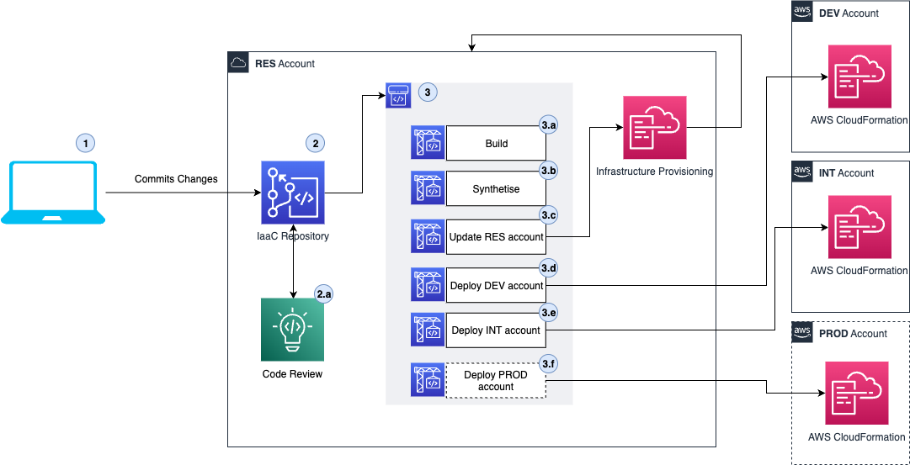

# {{ project_name }}

## Introduction

The {{ project_name }} is a comprehensive CI/CD platform for AWS CDK-based applications and solutions. It provides a standardized and easy-to-use Continuous Integration solution leveraging AWS CodeBuild. The process ensures that the codebase follows code style guidelines, can be successfully compiled, runs supplied tests, and performs various quality checks related to security.

Once the codebase successfully passes the quality gates, the {{ project_name }} enables Continuous Deployment of the solution across multiple stages, such as DEV, INT, and PROD. For each stage, you can configure pre and post deployment steps to hook in various activities like integration and end-to-end testing. Additionally, you can have post-deployment steps to finalize the deployment activities.

## Why use the {{ project_name }}?

Setting up CI/CD pipelines for AWS CDK-based projects is a recurring and time-consuming activity for many teams. This process often results in different "flavors" of pipelines, leading to duplicated effort and increased maintenance and governance complexity.

The CI/CD process setup is often thought of as a one-time activity, but in reality, it is a continuous process that needs to be done systematically.

The {{ project_name }} can address these issues and drastically reduce the effort needed to maintain and develop AWS CDK-based solutions, allowing you to focus on your solution while it takes care of the CI/CD process.

Here are some key features provided by the {{ project_name }}:

- :white_check_mark: [Customizable CI](../developer_guides/ci.md) steps to meet project requirements
- :white_check_mark: Integration of various [security scanning tools](../developer_guides/security.md)
- :white_check_mark: Multi-staged Continuous Deployment process
- :white_check_mark: Flexible definition of stages, with the ability to extend the default (DEV/INT/PROD) stages with custom stages like EXP
- :white_check_mark: Separate stack deployment specification for each stage
- :white_check_mark: Pre/Post deploy hooks during the deployment in each stage (DEV/INT/PROD)
  - :white_check_mark: PRE -> Unit Tests
  - :white_check_mark: POST -> Functional Tests, Load Testing
- :white_check_mark: Automated Open Source License checking (with a provided list of licenses that should not be present in your PRODUCTION workloads)
- :white_check_mark: Centralized storage of compliance logs in S3 buckets pre-configured on a per-stage/environment basis
- :white_check_mark: Build Lambda Layers for Python and scan dependencies in the CI/CD (in case of CVE findings, block the pipeline)

These features can be used independently in any project as part of the {{ project_name }} CLI, even if your project is not based on AWS CDK.

## CI/CD Process Overview

The CI/CD process in the {{ project_name }} establishes the following:

1. Changes are committed to the Git repository in a branch, and a Pull Request (PR) is created for the `main` branch.
2. The PR is reviewed, approved, and merged into the `main` branch.
   - For AWS CodeCommit repositories, the {{ project_name }} provides out-of-the-box [automatic PR checks](../developer_guides/vcs_codecommit.md).
3. Once the codebase is merged into `main`, an AWS CodePipeline is triggered to execute the CI/CD process:
   - **Build**: This is the Continuous Integration step, which executes the build, test, lint, and audit actions to ensure code quality and security before deployment to any stages.
   - **Synthesize**: This step executes `cdk synth` and runs the CDK Nag to promote infrastructure best practices.
   - **Update RES**: This step updates the infrastructure elements in the RES account with the AWS CloudFormation Service.
   - **Update DEV**: This step updates the infrastructure elements in the DEV account with the AWS CloudFormation Service.
   - **Update INT**: This step updates the infrastructure elements in the INT account with the AWS CloudFormation Service.
   - **Update PROD**: This step updates the infrastructure elements in the PROD account with the AWS CloudFormation Service.

## Infrastructure Elements

The {{ project_name }} architecture is based on using DevOps services provided by AWS to deliver the CI/CD solution.

You can read more about these elements in the [Developer Guide](../developer_guides/index.md).

## Getting Started

If you are eager to start using the {{ project_name }}, check out the [Getting Started](../getting_started/index.md) guides.

## Contributing to the {{ project_name }}

The team encourages you to contribute to make it an even better framework. For details, see [contributing](../contributing/index.md).
