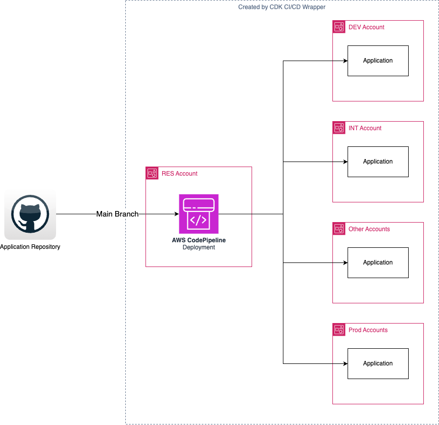

# Git Branching Strategies

The {{ project_name }} can be used with git branching strategies as described below.

# Trunk-Based Development

Trunk-based development has no branches, and changes are committed directly to the main trunk. One `cicd.config.ts` with default options covers this:

```typescript
import { defineCICD, Repository } from '@cdklabs/cdk-cicd-wrapper';

export default defineCICD({
  application: 'my-app',
  repository: Repository.codecommit('my-repo'), // tracks 'main' by default
  stages: ['dev', 'int'],
});
```

{ width="75%" }

# Git(x)Flow Feature Branches

[GitFlow](https://nvie.com/posts/a-successful-git-branching-model/), [GitHub Flow](https://githubflow.github.io/) and [GitLab Flow](https://about.gitlab.com/topics/version-control/what-is-gitlab-flow/) are development methodologies where work happens on branches that merge into the main trunk when ready for production. There are two ways to use the {{ project_name }} with these methodologies.

## Local ad hoc deploys (no pipeline)

Blueprint (0.x) had a `.workbench()` section for deploying a feature branch's stacks directly from a developer's machine, without a pipeline. There is no equivalent construct in Autopilot — you don't need one, because `cdk.json`'s `app` command (`npx cdk-cicd exec bin/my-app.ts`) already runs *every* `cdk` invocation through the wrapper, pipeline or not. Deploy ad hoc straight from your branch:

```bash
npx cdk deploy --all
```

This deploys with whatever `CDK_STAGE`/`AppConfig` resolves to locally (the `local` stage, absent an override — see [AppConfig](./cd.md#varying-application-level-configuration-per-stage)). Give the stack a distinct name (for example suffixed with your username) if you don't want it colliding with a pipeline-managed stack of the same base name:

```typescript
new MyStack(app, 'my-app', { stackName: `my-app-${process.env.USER}` });
```

!!! note

    Unlike Blueprint's `.workbench()`, this has no built-in per-user resource prefixing, no automatically-created compliance/encryption stacks, and no `workbench destroy` — clean up with `cdk destroy` yourself.

## Feature pipelines

A feature pipeline is a **second, independent** pipeline that tracks a feature branch instead of `main`, deployed with its own `cicd.config.ts`. Since `cicd.config.ts` is just a TypeScript file, keep the feature branch's copy **uncommitted to trunk** (the same convention Blueprint's `.workbench()` followed) — for example, a `cicd.config.feature.ts` you swap in locally, or a small branch-name check inside `cicd.config.ts` itself:

```typescript
// cicd.config.ts, on a feature branch only -- not merged back to main
import { defineCICD, Repository } from '@cdklabs/cdk-cicd-wrapper';

export default defineCICD({
  application: 'my-app-feature1', // distinct application/qualifier avoids clashing with the main pipeline
  qualifier: 'f1app',
  repository: Repository.codestarConnection('org/my-app', 'arn:aws:codestar-connections:...', 'feature1'),
  stages: [
    { name: 'feature1dev', env: { account: '222222222222', region: 'eu-west-1' }, manualApproval: false },
    { name: 'feature1int', env: { account: '333333333333', region: 'eu-west-1' }, manualApproval: true },
  ],
});
```

Run `cdk-cicd deploy-ci` from that branch's checkout to provision the feature pipeline. It builds and deploys its own copy of the stacks in `bin/`/`lib/` — the same source, a different pipeline.

!!! note

    * `application`/`qualifier` must differ from the main pipeline's to avoid duplicate/clashing resources.
    * Stage names must be unique across pipelines sharing accounts/regions with the main pipeline.
    * Resources must be cleaned up manually (deleting the CloudFormation stacks in the accounts where they were created) when the feature branch merges or is abandoned.

## Developer sandbox pipelines

The same feature-pipeline pattern also covers a per-developer sandbox: point `repository` at the developer's branch and `stages` at their personal sandbox account. Unlike Blueprint (0.x) — where the compliance/access-log bucket was on by default and had to be explicitly disabled (`GlobalResources.COMPLIANCE_BUCKET`) to run a pipeline and its deployment target in the same account — Autopilot's compliance bucket is opt-in (`complianceLogBucketName` in `cicd.config.ts`), so simply leaving it unset avoids the conflict; there is nothing to disable.
