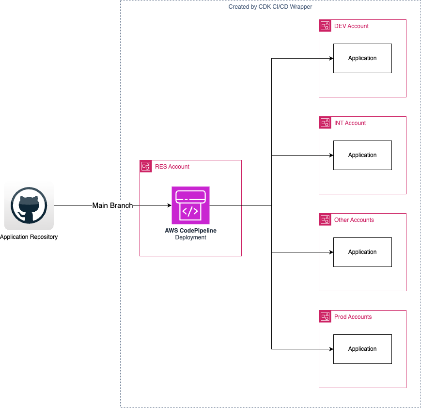
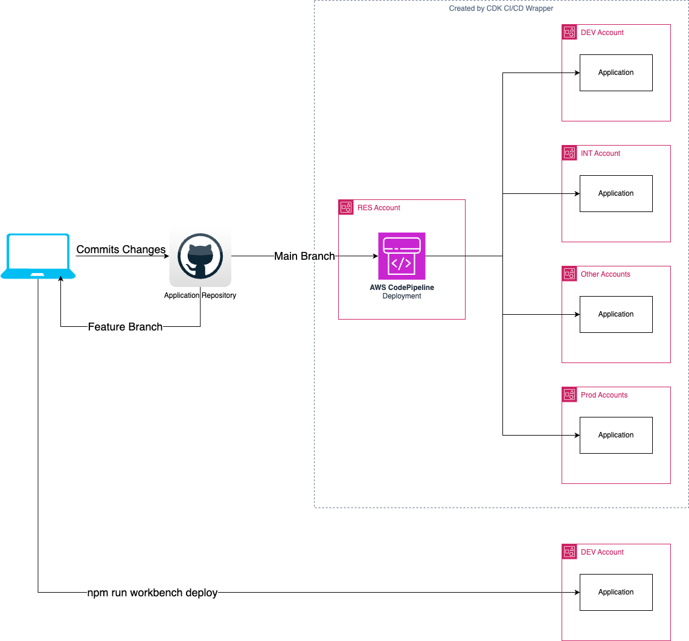

# Git Branching Strategies

The CDK CI/CD Wrapper can be used with git branching strategies as described below.

# Trunk-Based Development

Trunk-based development has no branches, and changes are committed directly to the main trunk.  The PipelineBlueprint is used with default options and has the following parameters:

```
PipelineBlueprint.builder()
    .defineStages([
        Stage.RES,
        Stage.DEV,
        Stage.INT,]
    )
    .addStack({
        provide: (context) => {
            new MyStack(context.scope, `${context.blueprintProps.applicationName}Stack`, {
        });
        },
    })
    .synth(app);
```


{ width="75%" }

# Git(x)Flow Feature Branches

GitFlow, GitHub Flow and GitLab Flow are development methodologies where work is done on branches that are merged into the main trunk when they are ready to be deployed into production.  There are three ways that the CDK CI/CD Wrapper can be used with these types of methodologies.

## Workbench Deployments

Workbench deployments are deployed directly from the developer's environment.  An additional `.workbench()` section is added to the pipeline builder that includes the stacks that the developer is working on in their feature branch.  The `.workbench()` section should not be committed to the trunk because it is specific to a branch and is no longer necassary when the branch is merged.

```
PipelineBlueprint.builder()
    .defineStages([
        Stage.RES,
        Stage.DEV,
        Stage.INT,]
    )
    .workbench({
        provide: (context) => {
        // This is a duplicate of the stack below
            new MyStack(context.scope, `${context.blueprintProps.applicationName}Stack`, {
        });
        },
    })
    .addStack({
        provide: (context) => {
            new MyStack(context.scope, `${context.blueprintProps.applicationName}Stack`, {
        });
        },
    })
    .synth(app);
```

Changes are deployed to the workbench account with the `npm run workbench deploy` command.  They can be removed with `npm run workbench destroy`.

{ width="75%" }

!!! note

    * Workbench resources are a copy of the stack in the `.addStack()` section, not the exact same stack.
    * The resources that are deployed will be prefixed with the username of the currently logged in user so that multiple users can deploy into the same development or sandbox account
    * No pipeline is created for the workbench deployment and the developer must manually deploy all changes
    * Compliance and encryption stacks are created for every workbench
    * Resources must be manually cleaned up either with `workbench destroy` or by deleting the associated Cloudformation stacks
    * If the workbench stack builds containers they will be compiled for the architecture of the developer's device (eg. ARM64), not the CodeBuild environment used by the pipeline


## Feature Pipelines

Feature pipelines can be created to automatically deploy from a code branch to a set of accounts.  This is a separate pipeline that exists for the lifetime of the feature and can deploy into multiple accounts.

It is not possible to have both a `.workbench()` section and a second pipeline.

```
// Main branch pipline
PipelineBlueprint.builder()
    .defineStages([
        Stage.RES,
        Stage.DEV,
        Stage.INT,]
    )
    .addStack({
        provide: (context) => {
            new MyStack(context.scope, `${context.blueprintProps.applicationName}Stack`, {
        });
        },
    })
    .synth(app);

// Feature branch pipeline
PipelineBlueprint.builder()
    .repository(RepositorySource.github({
        codeStarConnectionArn: 'arn:aws:codeconnections:us-east-1:111111111:connection/aaaaaaa',
        repositoryName: 'repoowner/project',
        branch: 'feature1'
    }))
    .defineStages([
        Stage.RES,
        { stage: 'feature1stagedev', account: '2222222222', region: 'us-east-1', manualApprovalRequired: false },
        { stage: 'feature1stageint', account: '3333333333', region: 'us-east-1', manualApprovalRequired: true },
        ]
    )
    .addStack({
        provide: (context) => {
            new MyStack(context.scope, `${context.blueprintProps.applicationName}Stack`, {
        });
        },
    })
    .applicationName('feature1app')
    .applicationQualifier('f1')
    .synth(app);
```

{ width="75%" }

!!! note

    * Each pipeline will have a copy of the `.addStack()` section, not the exact same stack.
    * A repository section must be added to the pipeline builder that identifies the branch to use
    * Stages other than RES must have a full stage definition because names such as `Stage.Dev` cannot be re-used in a second pipeline
    * Application name and qualifier must be supplied to prevent duplicate resources being created
    * Resources in stacks should use naming conventions that prevent name clashes when multiple versions are deployed into the same account
    * Resources must be manually cleaned up by deleting Cloudformation stacks in the accounts where they are created when the feature branch is merged into trunk

## Developer Sandbox Pipelines

Pipelines for individual developers can be created to automatically deploy from a code branch to a personal sandbox account.  This differs from the feature branch approach above because the Code Pipeline is in the sandbox account, not the RES account.

It is not possible to have both a `.workbench()` section and a second pipeline.

```
// Main branch pipline
PipelineBlueprint.builder()
    .defineStages([
        Stage.RES,
        Stage.DEV,
        Stage.INT,]
    )
    .addStack({
        provide: (context) => {
            new MyStack(context.scope, `${context.blueprintProps.applicationName}Stack`, {
        });
        },
    })
    .synth(app);

// Feature branch pipeline
PipelineBlueprint.builder()
    .repository(RepositorySource.github({
        codeStarConnectionArn: 'arn:aws:codeconnections:us-east-1:111111111:connection/aaaaaaa',
        repositoryName: 'repoowner/project',
        branch: 'feature1'
    }))
    .defineStages([ // Two stages are required even though RES and DEV are the same
        { stage: 'RES', account: '111111111', region: 'us-east-1', manualApprovalRequired: false },
        { stage: 'feature1stagedev', account: '111111111', region: 'us-east-1', manualApprovalRequired: true },
        ]
    )
    .disable(GlobalResources.COMPLIANCE_BUCKET)
    .addStack({
        provide: (context) => {
            new MyStack(context.scope, `${context.blueprintProps.applicationName}Stack`, {
        });
        },
    })
    .applicationName('feature1app')
    .applicationQualifier('f1')
    .synth(app);
```

{ width="75%" }

!!! note

    * The pipeline will have a copy of the `.addStack()` section, not the exact same stack.
    * A repository section must be added to the pipeline builder that identifies the branch to use
    * It is not currently possible to have compliance bucket support when a pipeline and deployment are in the same account, so this must be disabled
    * Both a RES and deployment environments must have full stage definitions even though they are the same account
    * Application name and qualifier must be supplied to prevent duplicate resources being created
    * Resources must be manually cleaned up by deleting Cloudformation stacks in the accounts where they are created