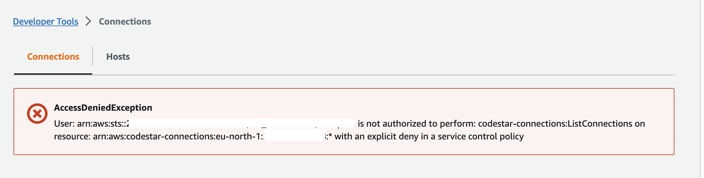
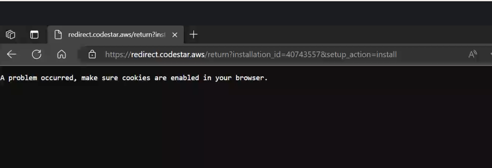

# GitHub Integration - AWS CodeStar Connection

To use a GitHub repository as your pipeline's source, an AWS CodeStar (CodeConnections) connection needs to be established first. For more details see the [GitHub connection](https://docs.aws.amazon.com/codepipeline/latest/userguide/connections-github.html) page.

## Quick Setup

Create the connection in the account where the pipeline will run:

```bash
aws codestar-connections create-connection --provider-type GitHub --region ${AWS_REGION} --connection-name MyConnection
```

This initializes the connection from the AWS side. Go to the AWS CodeStar Connections [console](https://console.aws.amazon.com/codesuite/settings/connections) and finish the installation through the browser.

**Note:** The user completing this needs:

- Ownership permission on the GitHub Organization / Account
- IAM permissions on the account:
  - `codestar-connections:ListConnections`
  - `codestar-connections:CreateConnection`
  - `codestar-connections:UpdateConnectionInstallation`

## Configuration

For the default (`CODEPIPELINE`) and `CDK_PIPELINES` engines, configure your pipeline with `Repository.codestarConnection`, passing the connection ARN from the step above — this is the one that actually works for those two engines. Plain `Repository.github(name, branch)` has **no** `connectionArn`, so the pipeline's source action fails to synthesize with `a CodeStar connection ARN is required for a github source` if you use it with either of these two engines:

```typescript
import { defineCICD, Repository } from '@cdklabs/cdk-cicd-wrapper';

export default defineCICD({
  application: 'my-app',
  repository: Repository.codestarConnection('owner/my-repo', 'arn:aws:codestar-connections:region:account:connection/uuid', 'main'),
  stages: ['dev', 'prod'],
});
```

`Repository.github(name, branch?)` (no connection ARN) is only meaningful with the `GITHUB_ACTIONS` engine below — GitHub Actions checks out the source itself, so there is no CodeStar-connection source action to build.

## GitHub Actions instead of an AWS-hosted pipeline

If you would rather render a `.github/workflows/deploy.yml` and let GitHub Actions run your pipeline (instead of AWS CodePipeline/CodeBuild), set `engine: EngineType.GITHUB_ACTIONS` — this requires `repository` to be `Repository.github(...)` (the workflow runs where GitHub already checked the source out):

```typescript
import { defineCICD, EngineType, Repository } from '@cdklabs/cdk-cicd-wrapper';

export default defineCICD({
  application: 'my-app',
  repository: Repository.github('owner/my-repo'),
  engine: EngineType.GITHUB_ACTIONS,
  stages: ['dev', 'prod'],
  githubActions: {
    // roleName defaults to '<application>-github-role'; subjectClaims defaults to every
    // ref/environment of 'owner/my-repo' when omitted.
  },
});
```

`cdk-cicd deploy-ci` only deploys the OIDC role (`GitHubActionRole`) the generated workflow assumes — the workflow itself is what runs the pipeline once you push it. See the [`Autopilot pipelines` workshop](../workshops/autopilot-pipeline/index.md) for a walkthrough.

**Current limitations:**

- `codeArtifact`/`proxy` are not yet wired for the GitHub Actions engine — the generated workflow includes the same login/proxy-export commands the other engines use, but not the IAM grants or environment variables that make them work at runtime (tracked in `findings.json` as `migration-github-actions-engine-missing-codeartifact-proxy-plumbing`). Don't rely on `codeArtifact`/`proxy` with this engine yet.
- **Bootstrap prerequisite:** the generated workflow's deploy step assumes the CDK deploy role with an explicit `ExternalId` (a `cdk-pipelines-github` default, not something this wrapper controls). If your environment was bootstrapped with the current CDK CLI default (`cdk bootstrap`'s `--deny-external-id`, enabled by default), that assume-role call is rejected outright and the deploy job fails. You need to either re-bootstrap without `--deny-external-id`, or allow-list exactly that `ExternalId` on the deploy role's trust policy (a minimally-customized `cdk bootstrap --template`, adding one statement, is enough — see `findings.json`'s `migration-github-actions-engine-deny-external-id-incompatibility` for the exact shape). This is a real prerequisite, not an edge case — it will block your very first real deploy on a freshly-bootstrapped account.

### Known Issues

- Careful if you see a page like this when you open the [Console](https://console.aws.amazon.com/codesuite/settings/connections)  You might be using a wrong **region** or you don't have the right permissions.
- Make sure you have cookies enabled for your browser and you have the right permissions on both AWS and GitHub side or you could see something as shown in the screenshot below 

## Pointers to external documentation

- [GitHub connection](https://docs.aws.amazon.com/codepipeline/latest/userguide/connections-github.html)
- [Update a pending connection](https://docs.aws.amazon.com/dtconsole/latest/userguide/connections-update.html)
