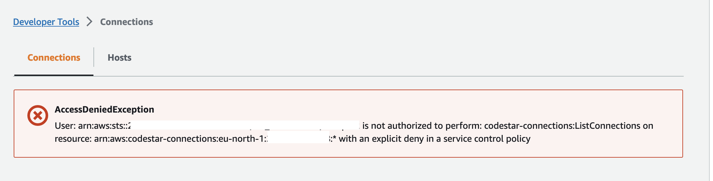

# GitHub Integration - AWS CodeStar Connection

To be able to use GitHub repositories in AWS CodePipeline with {{ project_name }}, an AWS CodeStar Connection needs to be established. For more details go to the [GitHub connection](https://docs.aws.amazon.com/codepipeline/latest/userguide/connections-github.html) page.

## Quick Setup

To create the AWS CodeStar Connection go to the desired AWS account where the AWS CodePipeline is planned to be placed and execute the following command.

```bash
aws codestar-connections create-connection --provider-type GitHub --profile $RES_ACCOUNT_AWS_PROFILE --region ${AWS_REGION} --connection-name MyConnection
```

This will initialize the connection from the AWS side. As a follow up go to the AWS CodeStar Connection on the [Console](https://console.aws.amazon.com/codesuite/settings/connections) and follow up the installation steps through the browser.

**Note:** The user needs to have the following permission to establish the connection.

- Ownership permission on the GitHub Organization / Account
- IAM Permissions on the account
  - codestar-connections:ListConnections
  - codestar-connections:CreateConnection
  - codestar-connections:UpdateConnectionInstallation

## Changing default branch

You can change the default branch which is picked up by the CodePipeline to trigger the pipeline with the following code snippet (during the pipeline definition):

```bash
import { BasicRepositoryProvider, PipelineBlueprint } from '@cdklabs/cdk-cicd-wrapper';

const pipeline = PipelineBlueprint.builder()
.repositoryProvider(new BasicRepositoryProvider({
      repositoryType: 'GITHUB',
      branch: 'main',
      name: 'my-repo',
    }))
...
```

### Known Issues

- Careful if you see a page like this when you open the [Console](https://console.aws.amazon.com/codesuite/settings/connections)  You might be using a wrong **region** or you don't have the right permissions.
- Make sure you have cookies enabled for your browser and you have the right permissions on both AWS and GitHub side or you could see something as shown in the screenshot below 

## Pointers to external documentation

- [GitHub connection](https://docs.aws.amazon.com/codepipeline/latest/userguide/connections-github.html)
- [Update a pending connection](https://docs.aws.amazon.com/dtconsole/latest/userguide/connections-update.html)
