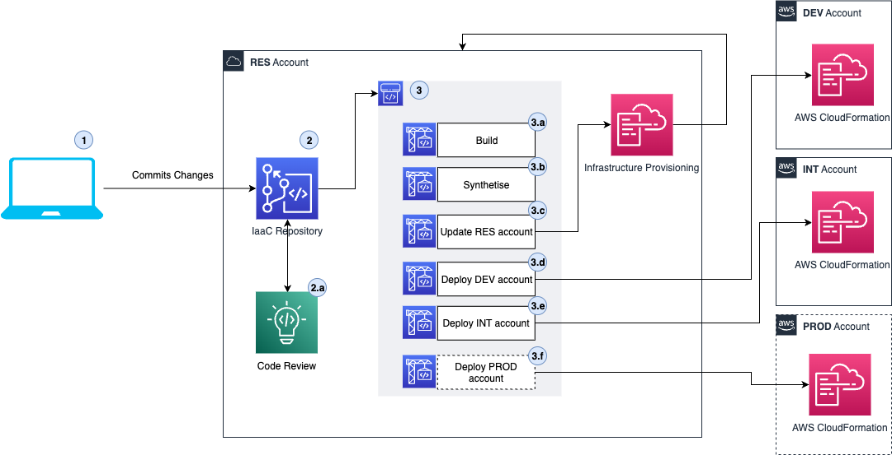
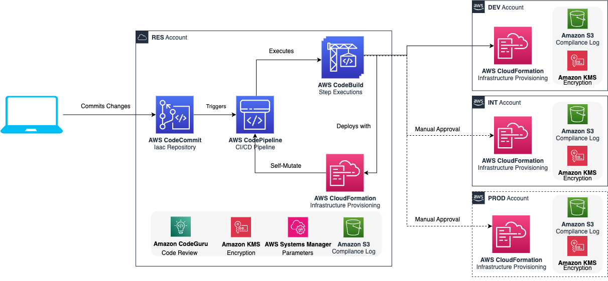

# {{ project_name }}

## What is the {{ project_name }}?

The {{ project_name }} provides an easy to use CI/CD platform for AWS CDK based applications and solutions.
With the {{ project_name }} you can standardized Continuous Integration solutions that leverage AWS CodeBuild. The process ensures the codebase follows code style guidelines, makes sure it can be successfully compiled, it runs the supplied tests, and runs various quality checks pertaining to security.

Once the codebase successfully passed the integration checks the {{ project_name }} - Continuous Deployment configuration allow for the deployment of the solution through multiple stages like DEV, INT, and PROD (and more based on your need). For each of the stages, pre and post deployment steps can be configured to hook in various activities, like integration and end to end testing. You can even have some post deployment steps finalize the deployment activities.

## Why use the {{ project_name }}?

Setting up a CI/CD pipelines for AWS CDK based projects is a recurring and time consuming activity on many projects. This activity is done by many teams and as such ends up in different _flavours_ which results in duplicated effort as well as increasing the maintenance and governance complexity.

A lot of the time, the CI/CD process setup is thought of as a one time activity, which is far from the truth, rather it is a continuous process that needs to be done systematically.

The {{ project_name }} can cope with these issues and can drastically reduce effort needed to maintain and develop AWS CDK based solutions and allows you to focus on **your** solution, while it takes care of the CI/CD process.

Let us list some of the features you get by using the {{ project_name }}:

- :white_check_mark: [Customizable CI](../developer_guides/ci.md) steps to meet project requirements
- :white_check_mark: Integration of various [security scanning tools](../developer_guides/security.md)
- :white_check_mark: Multi Staged Continuous Deployment process
- :white_check_mark: Flexible definition of stages, the default (DEV/INT/PROD) stages can be extended with new custom stages like EXP.
- :white_check_mark: Stacks deployment can be specified for each stages separately
- :white_check_mark: Pre/Post deploy hooks during the deployment in each of the stages (DEV/INT/PROD)
  - :white_check_mark: PRE -> Unit Tests
  - :white_check_mark: POST -> Functional Tests, Load Testing
- :white_check_mark: Automated Open Source License checking (we have provided a list of licenses which you don't want to have present in your PRODUCTION workloads) \*
- :white_check_mark: Centrally store compliance logs in S3 Buckets which are pre-configured on a per-stage/environment basis \*
- :white_check_mark: Build Lambda Layers for Python and scan dependencies in the CI/CD (in case of CVE findings, block the pipeline) \*

\* These features can be independent in any project as part of the {{ project_name }} CLI even if your project is not based on AWS CDK.

If you are eager to start, you can check out our [Getting Started](../getting_started/index.md) guides.

## What is the CI/CD process the {{ project_name }} set up?

The CI/CD process in the {{ project_name }} establishes the following:

1. The changes are committed to the GIT repository into a branch and then a PR has been created for the `main` branch of the repository.
2. The PR has been reviewed and approved and merged into the `main` branch
   1. In case the GIT repository is a AWS CodeCommit repository that the {{ project_name }} provides out of the box [automatic PR checks](../developer_guides/vcs_codecommit.md).
3. Once the codebase is merged to `main` an AWS CodePipeline is triggered to execute the CI/CD process.
   1. **Build**: This is the Continuous Integration step, which executes the build, test, lint, and audit actions to ensure the code quality and security before it is deployed to any Stages
   2. **Synthetise**: This steps executes the `cdk synth` and runs the CDK Nag to promote infrastructure best practices
   3. **Update RES**: This steps update the infrastructure elements in the RES account with the AWS CloudFormation Service
   4. **Update DEV**: This steps update the infrastructure elements in the DEV account with the AWS CloudFormation Service
   5. **Update INT**: This steps update the infrastructure elements in the INT account with the AWS CloudFormation Service
   6. **Update PROD**: This steps update the infrastructure elements in the PROD account with the AWS CloudFormation Service

## What are the infrastructure elements the {{ project_name }} introduces?

The {{ project_name }} architecture is based on using DevOps services provided by AWS to deliver the CI/CD solution.

You can read more about these elements in the [Developer Guide](../developer_guides/index.md)

## Contributing to the {{ project_name }}

The team encourages you to contribute to make it an even better framework. For details, see [contributing](../contributing/index.md).
