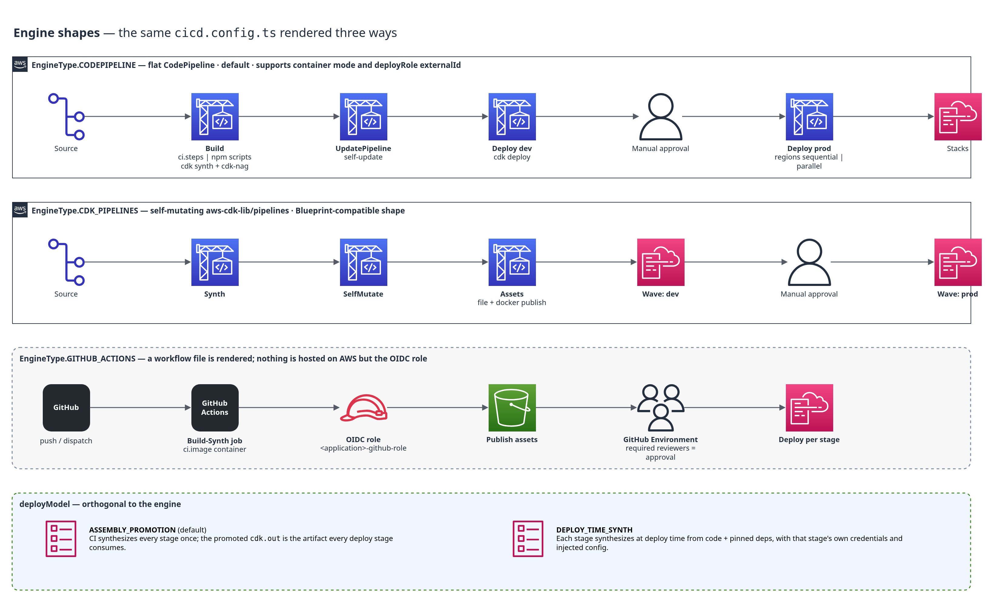
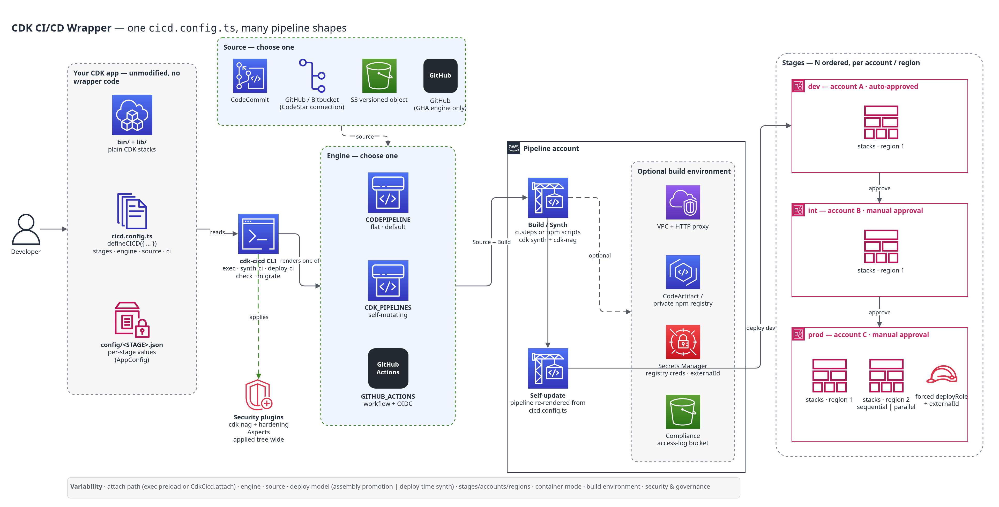
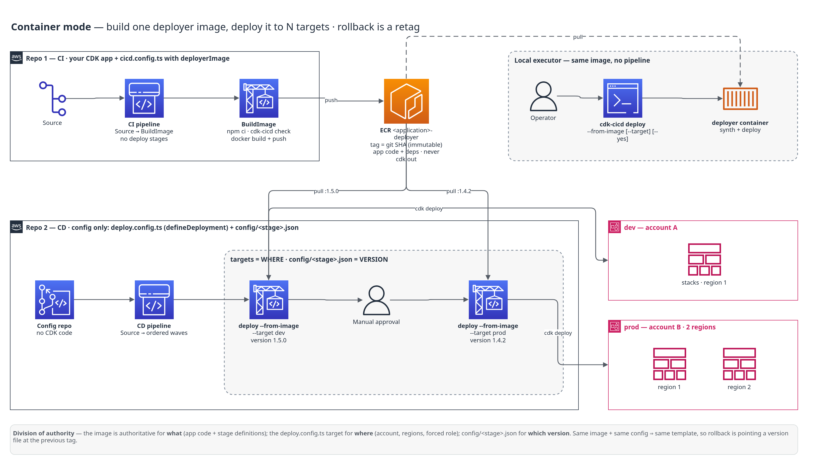

# {{ project_name }}

## Introduction

The {{ project_name }} is a comprehensive CI/CD platform for AWS CDK-based applications and solutions. It is config-driven and zero-touch: you describe your pipeline in one `cicd.config.ts` file, and the `cdk-cicd` CLI wraps it around your **unmodified** CDK app. It provides a standardized and easy-to-use Continuous Integration solution leveraging AWS CodeBuild — the process ensures that the codebase follows code style guidelines, can be successfully compiled, runs supplied tests, and performs various quality checks related to security.

Once the codebase successfully passes the quality gates, the {{ project_name }} enables Continuous Deployment of the solution across the stages you define — for example `dev`, `int`, and `prod` — gating every stage that isn't an inner-loop stage behind a manual approval by default.

## Why use the {{ project_name }}?

Setting up CI/CD pipelines for AWS CDK-based projects is a recurring and time-consuming activity for many teams. This process often results in different "flavors" of pipelines, leading to duplicated effort and increased maintenance and governance complexity.

The CI/CD process setup is often thought of as a one-time activity, but in reality, it is a continuous process that needs to be done systematically.

The {{ project_name }} can address these issues and drastically reduce the effort needed to maintain and develop AWS CDK-based solutions, allowing you to focus on your solution while it takes care of the CI/CD process.

Here are some key features provided by the {{ project_name }}:

- :white_check_mark: **Zero wrapper code in your app** (TypeScript/JavaScript apps) — your `bin/` stays exactly what `cdk init` produced; the pipeline lives in a separate `cicd.config.ts`. Non-Node apps (e.g. Python) use the explicit `CdkCicd.attach(app)` opt-in instead — see [Getting Started](../getting_started/index.md)
- :white_check_mark: [Customizable CI](../developer_guides/ci.md) steps that default to your project's own npm scripts (`npm run audit`/`build`/`test`)
- :white_check_mark: Integration of various [security scanning tools](../developer_guides/security.md) (cdk-nag, Bandit, Semgrep, ShellCheck, dependency-vulnerability scanning)
- :white_check_mark: Multi-staged Continuous Deployment process with manual-approval gating on by default for anything past your inner development loop
- :white_check_mark: Flexible definition of stages, including multi-region stages and per-stage AWS accounts
- :white_check_mark: A choice of pipeline engines — a lightweight [CodePipeline](https://docs.aws.amazon.com/cdk/api/v2/docs/aws-cdk-lib.aws_codepipeline-readme.html) by default, a [CDK Pipelines](https://docs.aws.amazon.com/cdk/api/v2/docs/aws-cdk-lib.pipelines-readme.html)-based engine, or a GitHub Actions engine that renders a workflow file instead of an AWS-hosted pipeline
- :white_check_mark: Automated Open Source License checking (with a provided list of licenses that should not be present in your PRODUCTION workloads)
- :white_check_mark: Optional centralized compliance/access-log bucket, VPC, and HTTP proxy support for every CodeBuild project the pipeline creates
- :white_check_mark: Dependency vulnerability scanning in the CI/CD for Node.js and Python dependencies (in case of CVE findings, block the pipeline)

Most of these features can be used independently of the CDK constructs, directly through the {{ project_name }} CLI.

## CI/CD Process Overview

The same `cicd.config.ts` is rendered by the engine you select (`engine`): a flat CodePipeline (the
default), a self-mutating CDK Pipelines pipeline, or a GitHub Actions workflow. `deployModel` is
orthogonal to that choice — synthesize every stage once and promote `cdk.out` (the default), or
synthesize each stage at deploy time with that stage's own credentials.

The CI/CD process in the {{ project_name }} establishes the following:

1. Changes are committed to the Git repository in a branch, and a Pull Request (PR) is created for the tracked branch (`main` by default).
2. The PR is reviewed, approved, and merged.
3. Once the codebase is merged, the pipeline is triggered to execute the CI/CD process:
   - **Build**: This is the Continuous Integration step, which runs your configured `ci.steps` or, by default, your project's own npm scripts (`npm run audit`/`build`/`test`, each run-if-present) to ensure code quality and security before deployment to any stage.
   - **Synthesize**: This step executes `cdk synth` and runs CDK Nag to promote infrastructure best practices.
   - **Self-update**: The pipeline updates its own definition from the latest `cicd.config.ts`.
   - **Deploy `<stage>`** (one action per configured stage): Updates the infrastructure elements in that stage's account/region with AWS CloudFormation. Stages other than your inner-loop stages (e.g. `dev`/`res`) are gated by a manual approval by default.

## Infrastructure Elements

The {{ project_name }} architecture is based on using DevOps services provided by AWS to deliver the CI/CD solution.

Your CDK app stays unmodified; `cicd.config.ts` (plus optional `config/<STAGE>.json` files) is read by the
`cdk-cicd` CLI, which renders the pipeline through the selected engine from the selected source
(CodeCommit, a CodeStar connection such as GitHub or Bitbucket, a versioned S3 object, or GitHub for the
GitHub Actions engine). The pipeline account hosts the build/synth and self-update projects plus the
opt-in build environment — VPC and proxy, CodeArtifact or a private npm registry, Secrets Manager–backed
credentials, and the compliance access-log bucket. Deployments then flow through your ordered stages,
each in its own account and region(s), gated by manual approval unless the stage is an inner-loop stage,
optionally assuming a forced deploy role with an ExternalId. The security plugins (cdk-nag and the
hardening Aspects) are applied tree-wide at synth on every path.

### Container mode

With the default CodePipeline engine you can split build from deploy: a CI repository builds a
config-agnostic deployer image into ECR, and a config-only CD repository (or the local
`cdk-cicd deploy --from-image` executor) runs that image against as many targets as you like. See the
[Container mode guide](../developer_guides/container_mode.md).

You can read more about these elements in the [Developer Guide](../developer_guides/index.md).

## Getting Started

If you are eager to start using the {{ project_name }}, check out the [Getting Started](../getting_started/index.md) guides.

## Contributing to the {{ project_name }}

The team encourages you to contribute to make it an even better framework. For details, see [contributing](../contributing/index.md).
