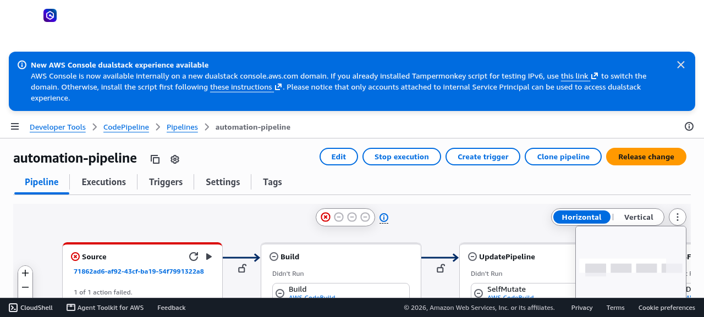

# A config-driven pipeline (Autopilot)

!!! abstract "What you'll build"
    - A working CodePipeline for a stock CDK app, provisioned from a single `cicd.config.ts`.
    - An understanding of **every** `defineCICD` field and when to reach for it.
    - A customized CI phase — your own named build steps and, optionally, a custom build image.

The whole Autopilot opt-in is two things: a `cicd.config.ts`, and pointing `cdk.json` at `cdk-cicd exec`.

## 1. Your app stays plain CDK

`bin/app.ts` is exactly what `cdk init` gave you — a plain `App` with your stacks. No `PipelineBlueprint`,
no builder, no wrapper import:

```ts
// bin/app.ts
import * as cdk from 'aws-cdk-lib';
import { MyStack } from '../lib/my-stack';

const app = new cdk.App();
new MyStack(app, 'my-app', {
  env: { account: process.env.CDK_DEFAULT_ACCOUNT, region: process.env.CDK_DEFAULT_REGION },
});
```

## 2. Describe the pipeline in `cicd.config.ts`

```ts
// cicd.config.ts
import { defineCICD, Repository } from '@cdklabs/cdk-cicd-wrapper';

export default defineCICD({
  application: 'my-app',
  repository: Repository.codecommit('my-app'),   // or .github('org/my-app', 'main') / .s3('bucket/app.zip')
  stages: ['dev', 'prod'],
});
```

## 3. Point `cdk.json` at the wrapper's exec hook

```json
{
  "app": "npx cdk-cicd exec bin/app.ts"
}
```

`cdk-cicd exec` runs your app under a preload that injects the resolved config (and tags, synthesizer, and
compliance Aspects) around it — which is how your untouched `bin/` becomes wrapper-aware without importing
anything.

## 4. Provision the pipeline — once

```bash
npx cdk-cicd deploy-ci
```

This deploys **one** pipeline into your hub account from `cicd.config.ts` alone. On every run it:

```
Source → Build (checks + synth) → UpdatePipeline (re-deploys itself from config) → deploy dev → deploy prod
```



*The flat Autopilot pipeline in the CodePipeline console — one linear pipeline, not Blueprint's 100+ CodeBuild projects.*

The **UpdatePipeline** stage means you never run `deploy-ci` again by hand: change `cicd.config.ts`, push,
and the pipeline re-synthesizes its own definition on the next run and applies the change before the
stages it affects.

## Every field of `defineCICD`

The two-stage example above uses three fields. Here is the full set, and **why each matters** — you'll
only ever write the few you need, because the wrapper resolves sensible defaults for the rest.

| Field | What it does | Why it matters |
|---|---|---|
| `application` | Logical name for the app and its resources. Defaults from `package.json#name`. | The prefix on pipeline and support-stack names — set it once so resources are recognizable. |
| `qualifier` | Short (≤10 char) sanitized id used to disambiguate shared resources. Derived from `application`. | Only set it if two apps would otherwise collide on shared names. |
| `repository` | The pipeline's source: `Repository.github('org/repo', branch?)`, `Repository.codecommit('name', branch?)`, or `Repository.s3('bucket/key', branch?)`. | This is *where* the pipeline reads code and *what* triggers it — the one field you almost always set explicitly. |
| `stages` | Ordered list of deployment stages — bare names or objects with `env`, `manualApproval`, `deployment`. | Your promotion path (dev → prod). Config-as-data, not pipeline code. Covered in the next chapter. |
| `ci` | Customizes the CI phase: `steps`, `synthStages`, `image`. | Add your own build/test steps or a custom image. See [Customizing CI](#customizing-ci) below. |
| `codeArtifact` | Authenticates builds to a private CodeArtifact repo (`domain`, `repository`, `account?`, `region?`, `npmScope?`). | Needed when your deps (or the wrapper itself, pre-release) live in a private registry. See chapter 4. |
| `deployModel` | `DeployModel.ASSEMBLY_PROMOTION` (default) or `DeployModel.DEPLOY_TIME_SYNTH`. | Controls when synth happens — one synth per run vs per-stage at deploy time. See chapter 3. |
| `asyncDeploy` | `boolean` (default `false`). Hands the CloudFormation wait to a Lambda instead of holding a build. | Saves build compute when the CloudFormation wait dominates. See chapter 3. |
| `synthesizer` | `{ type?: SynthesizerType.DEFAULT \| SynthesizerType.APP_STAGING }`. | `DEFAULT` (`DefaultStackSynthesizer`) suits most apps; opt into `APP_STAGING` for per-app staging + roles-only bootstrap. |
| `engine` | Selects the CD engine (`EngineType`). | `EngineType.CODEPIPELINE` is the default and covers most cases — you rarely set it. Two alternates exist: `CDK_PIPELINES` (plain CDK Pipelines, no CodePipeline-specific extras) and `GITHUB_ACTIONS` (renders a `.github/workflows/deploy.yml` instead of an AWS-hosted pipeline — see [GitHub as source & CD engine](../../developer_guides/vcs_github.md)). Tuning for the default engine lives on the stages and `ci` (chapter 3), not here. |
| `githubActions` | GitHub Actions engine config (`roleName`, `subjectClaims`, `workflowTriggers`, etc.). | Only read when `engine` is `EngineType.GITHUB_ACTIONS`. |
| `deployerImage` | Turns the pipeline into a config-agnostic image builder (`BuildImage.docker({...})`). | The container-mode entry point. See chapter 5. |

!!! tip "Start small"
    The minimum config is `repository` + `stages`. `application` defaults from `package.json#name`, the
    engine defaults to CodePipeline, and the synthesizer defaults to `DefaultStackSynthesizer`. Add fields
    only when a default doesn't fit.

## Customizing CI

The `ci` block shapes the Build phase. All three sub-fields are optional; with none set, the build runs
your project's own golden-path scripts (`npm run audit`/`build`/`test`, each run-if-present, warn-if-absent)
plus the synth step.

**Named build steps (`ci.steps`)** — a map of `{ name: shell-command }`. Each entry becomes a named step
in the CI build, so you add project-specific gates without editing pipeline code:

```ts
import { defineCICD, Repository } from '@cdklabs/cdk-cicd-wrapper';

export default defineCICD({
  application: 'my-app',
  repository: Repository.github('my-org/my-app'),
  stages: ['dev', 'prod'],
  ci: {
    steps: {
      lint: 'npm run lint',
      test: 'npm test',
      audit: 'npx cdk-cicd check-dependencies',
    },
  },
});
```

**A custom build image (`ci.image`)** — point CI at your own CodeBuild image (a registry reference) when
you need tools the default image doesn't ship:

```ts
  ci: {
    image: 'public.ecr.aws/my-org/ci-node:20',   // custom CodeBuild image for CI steps
    steps: { test: 'npm test' },
  },
```

**Synth scope (`ci.synthStages`)** — `'all'` synthesizes every stage as a validation gate; a list narrows
it to specific stages when synth cost matters. This interacts with the deploy model, so it's covered in
chapter 3.

!!! info "The build image needs the AWS CLI"
    Steps like the CodeArtifact login and asset publishing shell out to the AWS CLI, which the default
    CodeBuild image ships. If you set a custom `ci.image`, make sure the AWS CLI is on its `PATH`.

## Verify

!!! success "Verify"
    Confirm the pipeline exists and runs end to end:

    - In the **CodePipeline** console, your pipeline shows the flat
      `Source → Build → UpdatePipeline → deploy dev → deploy prod` shape.
    - The most recent execution reaches **Succeeded** on every stage.
    - Compare the CodeBuild project count to a Blueprint pipeline: Autopilot provisions a small, constant set — not one
      per asset or per stage.

    You can also validate the config locally before pushing:

    ```bash
    npx cdk-cicd synth --all       # synthesizes every stage from your config
    ```

## Recap

You turned a stock CDK app into one flat CodePipeline with a single config file and a one-line `cdk.json`
change — no wrapper code in `bin/`. You know every `defineCICD` field, and you can add your own CI steps
and image. The next chapters go deep on the fields you'll reach for most: stages and approvals, deploy
models and tuning, private registries, and container mode.
