# Prerequisites

## AWS Account Setup

Before starting the workshop, ensure you have the following:

- **AWS Account** with administrative access
- **Default VPC** in your account
- **AWS Region**: You can use any of the following regions:
    - `us-east-1`
    - `us-east-2`
    - `us-west-2`
    - `eu-central-1`
    - `eu-west-1`
    - `eu-west-2`

### Amazon Bedrock Setup

We will be using Amazon Bedrock to access foundation models in this workshop. Below, we configure model access in Amazon Bedrock for building and running generative AI applications. Bedrock provides models from multiple providers.

#### Amazon Bedrock Setup Instructions

1. Search for **Amazon Bedrock** in the AWS console.
{: class="workshop-image"}

2. Expand the side menu and select **Model access**.
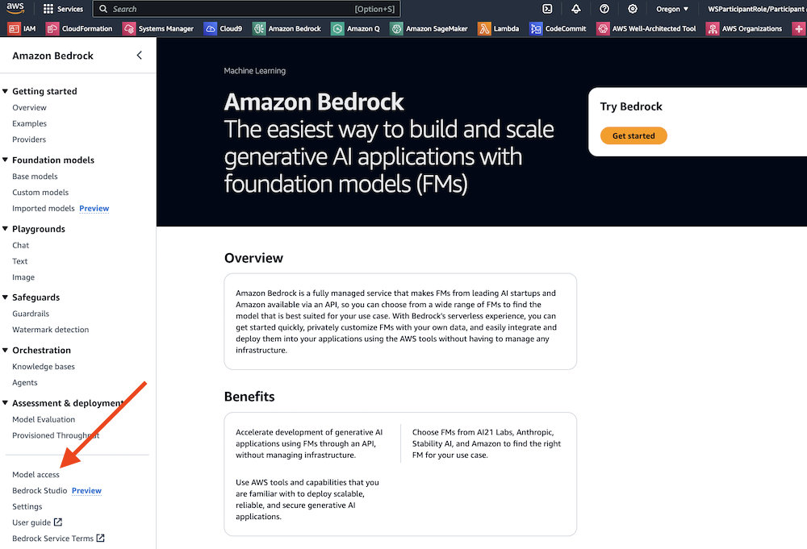{: class="workshop-image"}

3. Click **Enable specific models**.
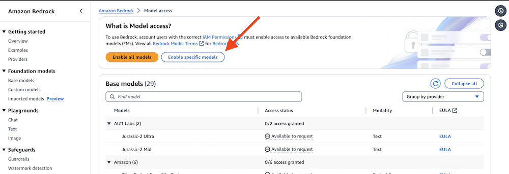{: class="workshop-image"}

4. Select the following models:
   - Amazon (All Titan models)
5. Click **Next**, review, and then submit.
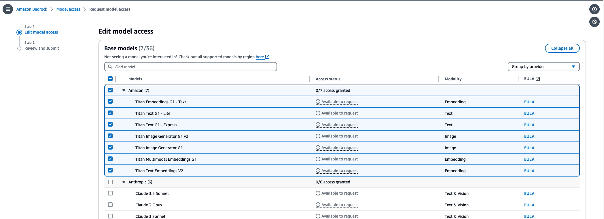{: class="workshop-image"}
6. Monitor model access status and ensure **Access granted**.
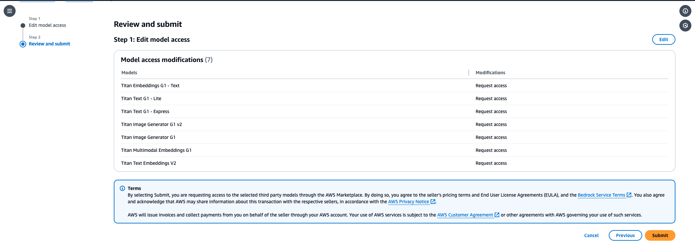{: class="workshop-image"}

<div style="border: 2px solid green; border-radius: 8px; background-color: #f0fdf4; padding: 10px;">
  <strong style="color: green;">✓ Congratulations!</strong><br/>
you've successfully set up Amazon Bedrock!
</div>

## Workspace Setup

You will need a workspace to run the workshop. You can use the [Amazon SageMaker Studio CodeEditor](#configure-amazon-sagemaker-studio-codeeditor) for this workshop or you can use your [local machine](#configure-local-machine).

### Configure Amazon SageMaker Studio CodeEditor
1. Download the CloudFormation template to your local machine: [cdk-cicd-workshop.yml](./assets/prerequisites/cdk-cicd-workshop.yml)

#### CloudFormation Stack Setup

Within your AWS account:

1. Navigate to **AWS CloudFormation** (via AWS Console) to create a new stack.
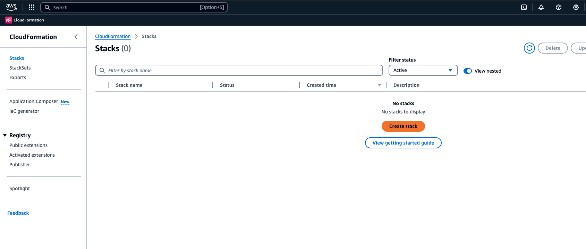{: class="workshop-image"}
2. On the "Create stack" screen, under the **Specify a template** section, select the **Upload a template file** option and navigate to select the `cdk-cicd-workshop.yml` file you downloaded earlier. Click **Next**.
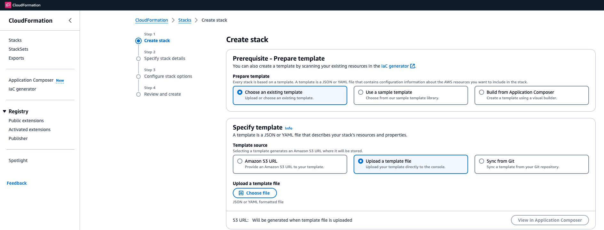{: class="workshop-image"}
3. On the "Specify stack details" screen, under the **Stack name** section, provide a name for the CloudFormation stack (e.g., `cdk-cicd-workshop`).
4. Leave the rest of the parameters unchanged, and click **Next**.
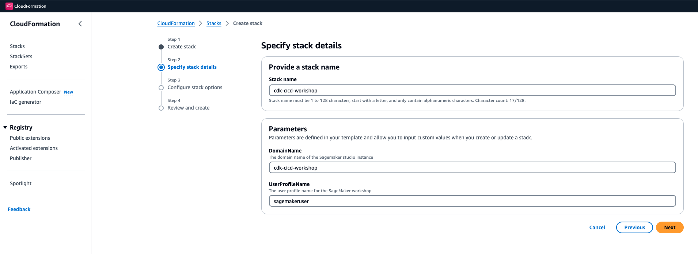{: class="workshop-image"}
5. On the "Configure stack options" screen, leave the default parameters unchanged, scroll to the bottom of the page, and click **Next**.
6. On the "Review" screen, scroll to the bottom of the page and check the box:  
   **"I acknowledge that AWS CloudFormation might create IAM resources."**. Click **Create Stack**.
   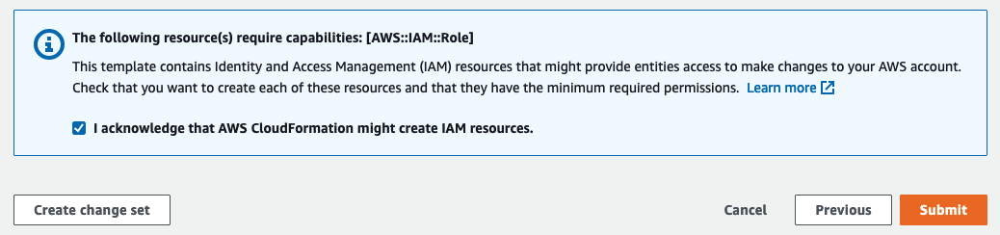{: class="workshop-image"}

CloudFormation will take a few minutes to run and set up your environment. Please wait for this step to complete.

<div style="border: 2px solid green; border-radius: 8px; background-color: #f0fdf4; padding: 10px;">
  <strong style="color: green;">✓ Congratulations!</strong><br/>
You have successfully deployed the AWS environment for this workshop. Next, we will verify the environment.
</div>


#### Open Amazon SageMaker Studio CodeEditor
1. In the AWS console, type "SageMaker" in the search bar and navigate to the **Amazon SageMaker** service page.
2. Click on the **Studio** link in the left navigation pane under the **Control Panel**.
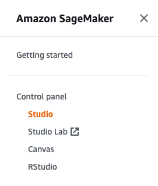{: class="workshop-image"}
3. You should see a pre-configured user. Click **Open Studio**.
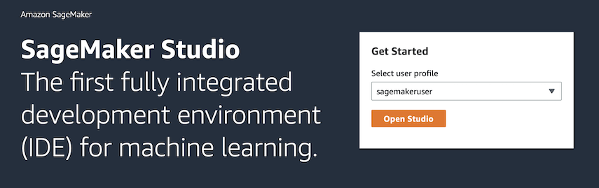{: class="workshop-image"}
   This will open the SageMaker Studio UI in a new browser window.
   
4. Click on the **Code Editor** icon under Applications and run the `my-space` application.
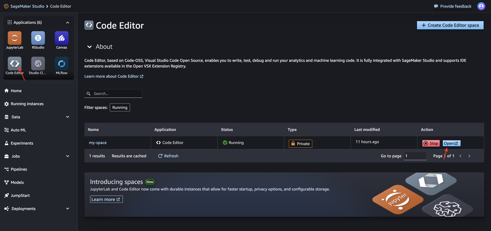{: class="workshop-image"}
5. Click **Open** to launch the Code Editor in a new browser tab.
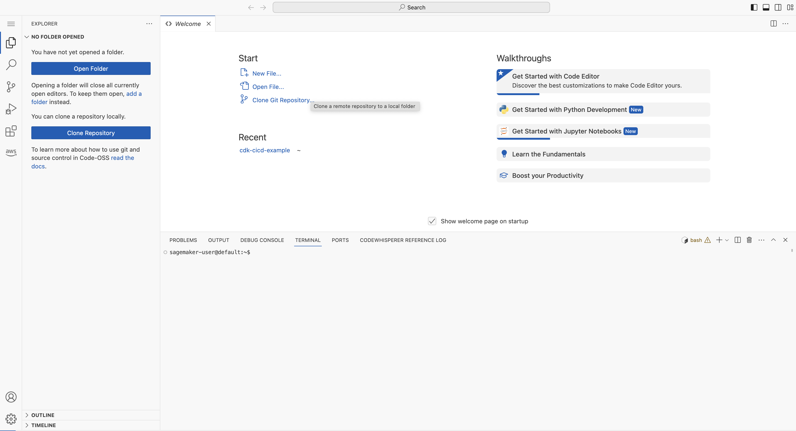{: class="workshop-image"}
6. In the Project folder, open the `cdk-cicd-example` project, which is already initialized for you.
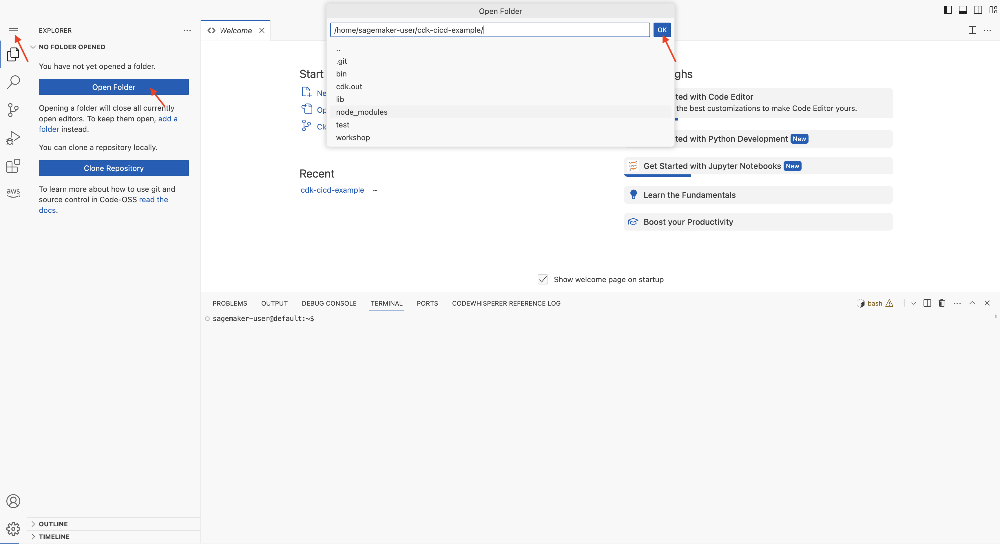{: class="workshop-image"}

<div style="border: 2px solid green; border-radius: 8px; background-color: #f0fdf4; padding: 10px;">
  <strong style="color: green;">✓ Congratulations!</strong><br/>
You have a ready to go CodeEditor.
</div>

Click **Next** to continue to the next section.

<a href="01-create-cdk-project.html" class="md-button">Next</a>

### Configure Local Machine

Install the following tools on your local machine:

- [AWS CLI](https://aws.amazon.com/cli/)
- [AWS CDK](https://docs.aws.amazon.com/cdk/latest/guide/work-with-cdk-python.html)
- [Docker](https://docs.docker.com/get-docker/)
- [Git](https://git-scm.com/book/en/v2/Getting-Started-Installing-Git)
- [Node.js](https://nodejs.org/en/download/)
- [Python](https://www.python.org/downloads/)

Configure the following environment variables:

```bash
export AWS_REGION=<region>
export AWS_ACCOUNT_ID=<account-id>
export AWS_PROFILE=<profile> # Optional in case you have multiple profiles
```

<div style="border: 2px solid green; border-radius: 8px; background-color: #f0fdf4; padding: 10px;">
  <strong style="color: green;">Congratulations!</strong><br/>
You have a ready to go workspace.
</div>

Click **Next** to continue to the next section.

<a href="01-create-cdk-project.html" class="md-button">Next</a>