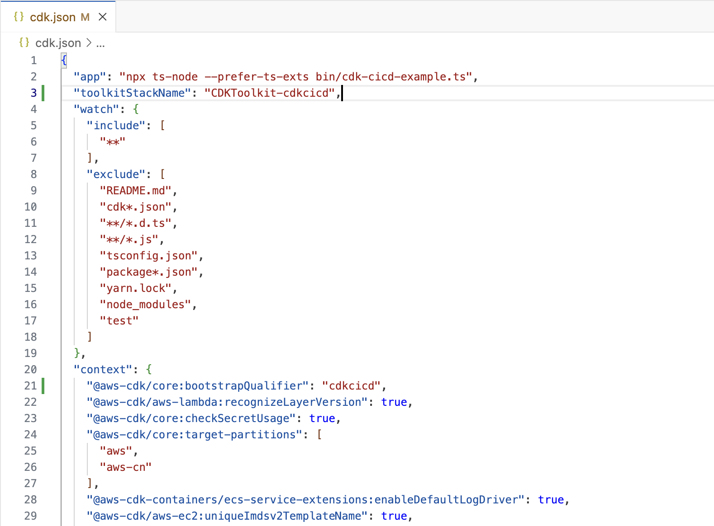

# Create a CDK Project & Bootstrap the AWS Account

In this section, we will create a CDK project and bootstrap your AWS account to prepare it for deploying resources using AWS CDK.

### Step 1: Create a CDK TypeScript Project
We will start by initializing a new CDK project in TypeScript.

```bash
npx -y aws-cdk init --language typescript
```

### Step 2: Add the CDK CI/CD Wrapper
To add the necessary wrapper for your project, run the following command:

```bash
npm install --include=dev --save @cdklabs/cdk-cicd-wrapper @cdklabs/cdk-cicd-wrapper-cli
```
### Step 3: Bootstrap the Resourcing (RES) Account

You need to bootstrap your AWS account so it can manage CDK resources. You can refer to the official [AWS CDK Bootstrapping Documentation](https://docs.aws.amazon.com/cdk/v2/guide/bootstrapping.html) for more details.

---

#### Optional: Modify `cdk.json` Configuration
Add the following CDK configurations to your `cdk.json` file for additional control over the bootstrapping process:

- **toolkitStackName**
- **@aws-cdk/core:bootstrapQualifier**

{: class="workshop-image"}

---

Bootstrap the Account

```bash
npm run cdk bootstrap
```

If you've configured `@aws-cdk-core:bootstrapQualifier`, use the following command with the qualifier:

```bash
npm run cdk bootstrap -- --qualifier cdkcicd
```

### Step 4: Verify the Bootstrap
After running the bootstrap command, verify that the `CDKToolkit` or if you've configured `toolkitStackName` stack is present in the AWS CloudFormation Service.

---

### Real-Life Setup for Multiple AWS Accounts
For this workshop, we are using a single AWS account. However, in real-world scenarios, each stage (e.g., DEV, INT, PROD) would have its own dedicated AWS account. You’ll need to bootstrap each of these accounts with the same CDK qualifier and establish trust with the resourcing account.

Here’s an example command to bootstrap a different account with a trust relationship:

```bash
npm run cdk bootstrap -- \
  --qualifier cdkcicd  \
  --profile <my_aws_profile_for_other_account> \
  --cloudformation-execution-policies arn:aws:iam::aws:policy/AdministratorAccess \
  --trust <resource_account_number> aws://<stage_account_number>/<region>
```

---

<div class="workshop-congrats-box">
  <strong class="workshop-congrats-title">✓ Congratulations!</strong><br/>
You have a created a CDK project and bootstrapped your AWS account for CDK development.
</div>

Click **Next** to continue to the next section.

<a href="02-define-quality-gates-ci.html" class="md-button">Next</a>