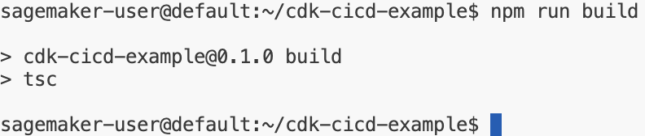

# Define the Quality Gates and Continuous Integration

In this section, we will guide you through setting up quality gates and continuous integration (CI) in your workflow. You’ll learn how to configure checkpoints to ensure your code meets standards and how to automate integration and testing using CI tools.

The setup of quality gates and CI may vary depending on the technologies and tools used in the project, but at a high level, they follow these key steps: code style checking or static code analysis (linting), vulnerability scanning for dependencies and the codebase, project building, and executing various tests.

We will mainly edit the `package.json` file in this section. Open that file and follow the steps below.

## Build & Test Steps

The build and test steps are already included in this workshop’s setup. Let’s test them.

### Step 1: Run the build command to transpile the TypeScript code to JavaScript.

```bash
npm run build
```

{: class="workshop-image"}

> **Congratulations!** You’ve successfully compiled the project. Your code is now transpiled from TypeScript to JavaScript.

### Step 2: Run the test command to execute the Unit tests.

```bash
npm run test
```


> **Well done!** You’ve completed running the unit tests. These checks ensure that your code behaves as expected.

## Unifying Code Style and Static Code Checks

### Step 3: Install ESLint

For NPM projects, it’s common to use **eslint** for code styling and static code analysis. To install eslint, run the following command:

```bash
npm install --save-dev eslint @eslint/core @eslint/js @types/eslint__js typescript typescript-eslint @stylistic/eslint-plugin
```

### Step 4: Create the ESLint Configuration File

Create a file called `eslint.config.mjs` in the project root with the following content:

```javascript
--8<----
content/workshops/basics-lvl300/assets/code/eslint.config.mjs
--8<----
```

> **Great job!** You’ve set up your ESLint configuration, which will help maintain code quality and uniformity across the project.

### Step 5: Add the lint script to `package.json`

Open the `package.json` file and insert a new script called `lint` like this: `"lint": "eslint ."`

Your `package.json` should look like:

```json
{
  "name": "cdk-cicd-example",
  "version": "0.1.0",
  "scripts": {
    "build": "tsc",
    "test": "jest",
    "lint": "eslint .",
    "cdk": "cdk"
  }
}
```

### Step 6: Run the lint script to test it.

```bash
npm run lint
```

> **Congratulations!** You’ve successfully run the linter. Your code is now checked for style and potential errors.

## Security Scan of Third-Party Dependencies and Codebase

### Step 7: Add a Third-Party dependency audit step

Edit the `package.json` and include the audit step for dependencies:

```json
"audit:deps": "cdk-cicd check-dependencies --npm --python"
```

This command will analyze both NPM and Python dependencies and report any known vulnerabilities.

> **Awesome!** You’ve added an important step to scan your third-party dependencies for vulnerabilities.

### Step 8: Add a security scan step for the codebase

Include the security scan for the source code in `package.json`:

```json
"audit:security-scan": "cdk-cicd security-scan --bandit --semgrep --shellcheck"
```

This will run scanners (Bandit, Semgrep, Shellcheck) on the codebase to detect security risks.

> **Well done!** You’ve set up the security scan to keep your code safe from common vulnerabilities.

## Ensure `package.json` Integrity

### Step 9: Validate `package.json`

Edit the `package.json` and include the following validation script:

```json
"validate": "cdk-cicd validate"
```

To run the validation:

```bash
npm run validate
```

This may fail on the first execution since validation hasn’t been executed before. To fix it, run:

```bash
npm run validate -- --fix
```

<div class="note">Repeat this process anytime you modify the `package.json` file.</div>

> **Fantastic!** You’ve ensured that your configuration is now validated, keeping your project secure and consistent.

## Verifying Third-Party Licenses

### Step 10: Audit licenses

Edit `package.json` to include a license audit step:

```json
"audit:license": "cdk-cicd license"
```

To run the license audit:

```bash
npm run audit:license
```

It may fail the first time because it verifies the existence of the `NOTICE` file in your repository. Fix it by running:

```bash
npm run audit:license -- --fix
```

This will generate the `NOTICE` file and the `OSS_License_Summary.csv` summarizing the used license types in your project.

<div class="note">Repeat this process anytime you modify the package.json, requirement.txt, and / or Pipfile.</div>

> **Congrats!** You’ve completed the license audit, ensuring all third-party dependencies are legally valid and accounted for.

## Concurrent Execution of Audits

Running multiple security checks can take time, so it's beneficial to parallelize them.

#### Step 10: Edit the `package.json` to include:

```json
"audit": "concurrently 'npm:audit:*'"
```

Install the dependency:

```bash
npm install --save-dev concurrently
```

Run the audit command:

```bash
npm run audit
```

If the audit fails due to `package.json` modifications, run:

```bash
npm run audit:license -- --fix
npm run validate -- --fix
```

Then, re-run:

```bash
npm run audit
```

> **Amazing!** You’ve successfully parallelized your audit tasks, saving time while ensuring your code remains safe and compliant.

### Summary

By the end of this section, we have defined all the necessary steps for a high-quality, robust CI pipeline for an AWS CDK-based project. These include:

- **validate**: Ensures our configuration isn’t tampered with.
- **build**: Ensures our code compiles correctly.
- **test**: Ensures tests are executed.
- **lint**: Ensures code style and quality.
- **audit**: Ensures dependencies are vulnerability-free and legally valid, and the codebase doesn't introduce security risks.


??? "Show Solution"
    The `package.json` file should look like this:
    ```json
    --8<----
    content/workshops/basics-lvl300/assets/code/package.json
    --8<----
    ```


<div class="workshop-congrats-box">
  <strong class="workshop-congrats-title">✓ Congratulations!</strong><br/>
You’ve completed setting up all your quality gates and continuous integration steps. You now have a strong foundation for building, testing, and securing your AWS CDK project!
</div>

Click **Next** to continue to the next section.

<a href="03-create-pipeline.html" class="md-button">Next</a>