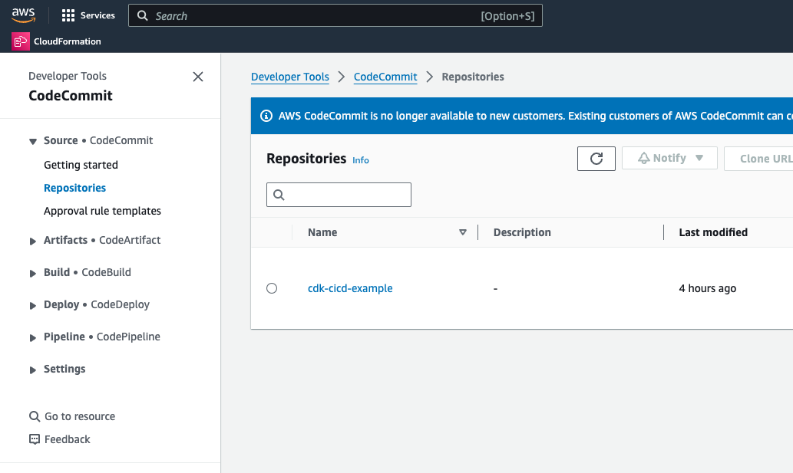
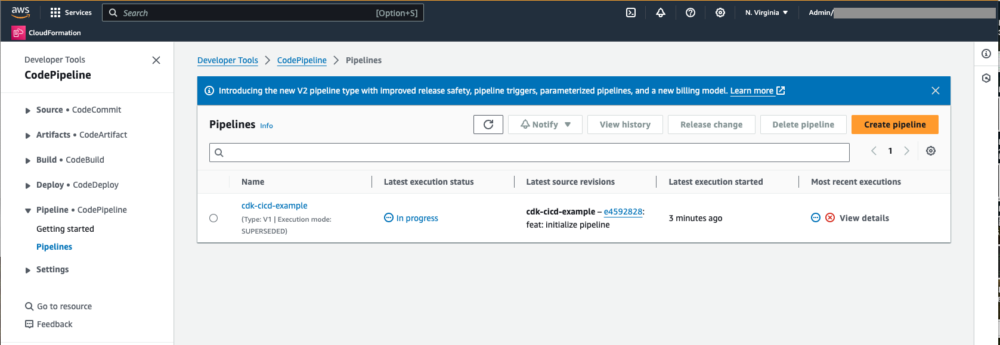
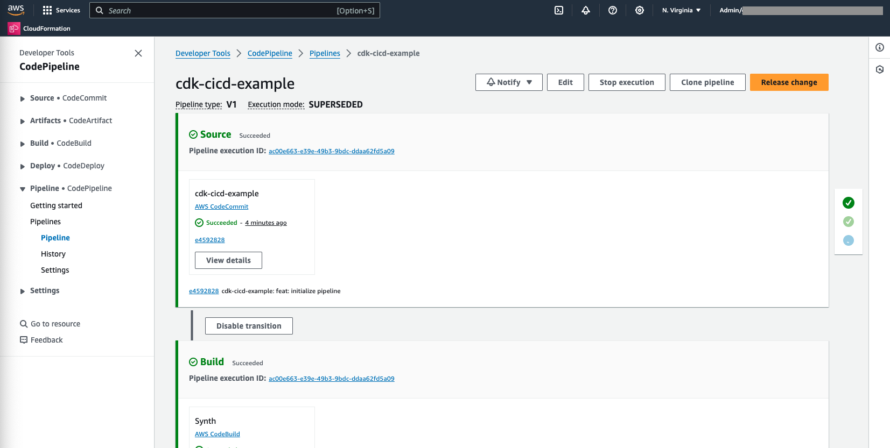

# Creating a Pipeline and Enabling GitOps

In this section, we are going to create the AWS CodePipeline and the required resources with the help of the CDK CI/CD Wrapper.

## Clean up the Example Stack

### Step 1: Open the Example File

First, open your `bin/cdk-cicd-example.ts` file. It should look like this:

```typescript
--8<----
content/workshops/basics-lvl300/assets/code/00-cdk-cicd-example.ts
--8<----
```

### Step 2: Remove the Example Stack

Let’s remove the example stack by deleting the following blocks:

```typescript
import { CdkCicdExampleStack } from '../lib/cdk-cicd-example-stack';
```

and

```typescript
new CdkCicdExampleStack(app, 'CdkCicdExampleStack', {
  /* Account/Region environment configuration */
});
```

### Step 3: Remove the unnecessary File

Delete the `lib/cdk-cicd-example-stack.ts` file, as it’s no longer needed.

### Step 4: Verify the Clean Up

Your `bin/cdk-cicd-example.ts` file should now look like this:

```typescript
--8<----
content/workshops/basics-lvl300/assets/code/01-cdk-cicd-example.ts
--8<----
```

## Create the Pipeline

### Step 5: Import the CDK CI/CD Wrapper

Now, let’s import the CDK CI/CD Wrapper. Add the following import statement after the `aws-cdk-lib` import:

```typescript
import * as wrapper from '@cdklabs/cdk-cicd-wrapper';
```

The updated `bin/cdk-cicd-example.ts` file should now look like:

```typescript
#!/usr/bin/env node
import 'source-map-support/register';
import * as cdk from 'aws-cdk-lib';
import * as wrapper from '@cdklabs/cdk-cicd-wrapper';

const app = new cdk.App();
```

### Step 6: Define the Pipeline with Builder

Next, we will create the pipeline using the CDK CI/CD Wrapper. Define the pipeline stages with the following code:

```typescript
wrapper.PipelineBlueprint.builder()
  .defineStages([
    { stage: wrapper.Stage.RES, account: process.env.AWS_ACCOUNT_ID },
  ])
  .synth(app);
```

<div class="note">You can also configure the <code>ACCOUNT_RES</code> environment variable with the AWS account ID instead of defining it through the <code>defineStages</code> method. The variables <code>ACCOUNT_DEV</code> and <code>ACCOUNT_INT</code> are supported as well.</div>

> **Congratulations!** Your code is ready to deploy the pipeline.

??? "Show Solution"
    The `bin/cdk-cicd-example.ts` file should look like this:
    ```typescript
    --8<----
    content/workshops/basics-lvl300/assets/code/02-cdk-cicd-example.ts
    --8<----
    ```

## Deploy the Pipeline

### Step 7: Verify the Code Can Be Synthesized

Run the following command to synthesize the pipeline:

```bash
npm run cdk synth
```


### Step 8: Deploy the Pipeline

Deploy the pipeline using this command:

```bash
npm run cdk deploy -- --all
```

During the deployment process, you will be asked to review the AWS IAM policies that will be deployed. After reviewing them, type 'y'.

<div class="workshop-congrats-box">
  <strong class="workshop-congrats-title">✓ Congratulations!</strong><br/>
The pipeline has been successfully deployed.
</div>

---

## (Optional) Review the Infrastructure

Let’s review the infrastructure that was deployed. Go to the **AWS CloudFormation** service and check the following stacks:

| Stack                                  | Description                                                                                            | Resources                           |
|----------------------------------------|--------------------------------------------------------------------------------------------------------|-------------------------------------|
| `cdk-cicd-example`                     | The core stack containing the AWS CodePipeline and all related resources like AWS CodeBuilds and IAM Roles. | Various resources                   |
| `cdk-cicd-exampleRepository`           | AWS CodeCommit repository stack with pull request verification and AWS CodeGuru Reviewer integration.      | CodeCommit, CodeGuru Reviewer       |
| `cdk-cicd-exampleSSMParameterStack`    | AWS SSM Parameters for environment variable mirroring.                                                   | SSM Parameters                      |
| `cdk-cicd-exampleEncryptionStack`      | AWS KMS Key used for data encryption at rest.                                                            | KMS Key                             |
| `cdk-cicd-exampleComplianceLogBucket`       | This stack ensures that an Amazon S3 Bucket exists for logging.                                           | S3 Bucket                           |

---

## Enabling GitOps

Now that our repository and pipeline are in place, we can start pushing changes to the repository.

### Step 9: Add the CodeCommit repository as a remote

```bash
git remote add origin codecommit::$AWS_REGION://cdk-cicd-example
```

### Step 10: Install the CodeCommit remote plugin

```bash
pip install git-remote-codecommit
```

### Step 11: Commit and push the changes

```bash
git add .
git commit -m "feat: initialize pipeline"
git push -u origin main
```

After pushing the changes, you can check the repository in the AWS Management Console.

{: class="workshop-image"}

> **Congratulations!** Your changes have been committed and pushed to the repository.

## Observe the Pipeline

After pushing the changes to the repository, it's important to observe the progress of the pipeline in AWS CodePipeline to ensure everything is working as expected.

### Step 12: Access AWS CodePipeline

1. Navigate to the [AWS Management Console]().

2. In the search bar, type CodePipeline and select AWS CodePipeline from the results.

{: class="workshop-image"}

3. In the CodePipeline dashboard, find the pipeline named `cdk-cicd-example` (or the name you've given your pipeline).

### Step 13: View Pipeline Stages

1. Click on the `cdk-cicd-example` pipeline to open its details.
2. You will see the different stages of the pipeline, such as Source, Build, and UpdatePipeline.

### Step 14: Monitor the Pipeline Execution

Each stage of the pipeline will show its current status. You can monitor the progress of each stage in real-time.

- **Source Stage**: This stage retrieves the latest commit from the AWS CodeCommit repository.
- **Build Stage**: In this stage, AWS CodeBuild runs the CI commands defined in your pipeline, compiling the code and running tests.
- **UpdatePipeline Stage**: Finally, the UpdatePipeline stage uses AWS CloudFormation to self-update the pipeline.

{: class="workshop-image"}

If the pipeline succeeds, all stages will be marked as Succeeded.

<div class="workshop-congrats-box">
  <strong class="workshop-congrats-title">✓ Congratulations!</strong><br/>
Your CI/CD pipeline is ready to be used.
</div>

Click **Next** to continue to the next section.

<a href="04-develop-genai-solution.html" class="md-button">Next</a>