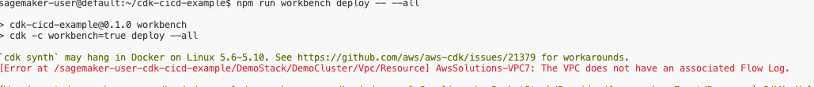
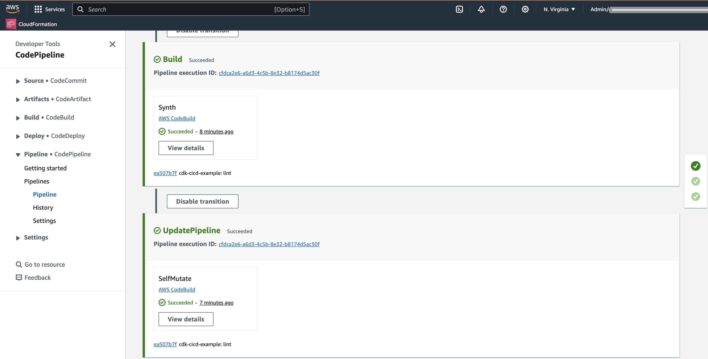

# Develop a GenAI Solution with CDK CI/CD Workbench

## What is Workbench?

A **Workbench** is a dedicated development environment where infrastructure code can be created, tested, and iterated upon before it's mature enough to be deployed through an automated pipeline. It’s particularly useful for development teams that don’t have personal AWS accounts for testing and experimentation. The Workbench allows developers to simulate their infrastructure changes in a safe environment without affecting the production pipeline. This ensures that the infrastructure code evolves and stabilizes before it’s promoted to deployment.

Now, let’s go through the steps to create a GenAI solution using the Workbench.

## Create an ECS Cluster in the Workbench

### Step 1: Create the Infrastructure Stack

We’ll begin by creating a file for defining an ECS Cluster.

1. **Create a file** in `lib/demo-stack.ts` and add the following content:

```typescript
--8<----
content/workshops/basics-lvl300/assets/code/00-demo-stack.ts
--8<----
```

> **Congratulations!** You’ve successfully created the infrastructure definition for an ECS Cluster.

### Step 2: Extend the Pipeline with a DEV Stage

1. **Open** the `bin/cdk-cicd-example.ts` file and modify the pipeline to add a DEV stage as the Workbench target.
2. **Replace** the `.defineStages` block with the following:

```typescript
.defineStages([
  { stage: wrapper.Stage.RES, account: process.env.AWS_ACCOUNT_ID },
  { stage: wrapper.Stage.DEV, account: process.env.AWS_ACCOUNT_ID },
])
```

> **Well done!** You’ve extended the pipeline to include a DEV stage, which will act as your Workbench.

### Step 3: Deploy the DEV Stage Configuration

Since we’ve defined a new stage with an environment variable, we need to deploy this change to the AWS SSM Parameter Store.

1. Run the following command to deploy the new stage:

    ```bash
    npm run cdk deploy -- --all
    ```

    Or you can deploy the specific SSM parameter stack:

    ```bash
    npm run cdk deploy -- cdk-cicd-exampleSSMParameterStack
    ```

> **Great!** The DEV stage has been successfully deployed.

### Step 4: Define the Workbench

1. **Update** the pipeline to define the Workbench by adding the following code:

```typescript
.workbench({
  provide(context) {
    new DemoStack(context.scope, 'DemoStack', { env: context.environment });
  },
})
```

2. **Import** the `DemoStack` class at the top of the file:

```typescript
import { DemoStack } from '../lib/demo-stack';
```

This code integrates the `DemoStack` into the Workbench environment.

> **Fantastic!** The Workbench has been successfully set up.

??? "Show Solution"
    The `bin/cdk-cicd-example.ts` file should look like this:
    ```typescript
    --8<----
    content/workshops/basics-lvl300/assets/code/03-cdk-cicd-example.ts
    --8<----
    ```

## Deploy the Workbench

Now that the Workbench has been set up, let’s deploy it to the AWS account.

### Step 5: Add a Utility Script to Package.json

1. **Open** the `package.json` file.
2. **Add** a utility script element for the Workbench:

    ```json
    "workbench": "cdk -c workbench=true"
    ```

> **Nice job!** The Workbench utility script has been added to your project.

### Step 6: Deploy the Workbench

Run the following command to deploy the Workbench environment:

```bash
npm run workbench deploy -- --all
```

This command will likely fail due to security checks.
    
{: class="workshop-image"}

> **Great start!** Now, let’s address the deployment issues.

### Step 7: Resolve CDK-Nag Errors

The CDK CI/CD Wrapper uses **CDK-Nag** to ensure secure and compliant deployments. Let’s resolve any errors that arise during the Workbench deployment.

1. **Open** the `lib/demo-stack.ts` file.
2. **Add** the following line to ensure proper logging for security purposes:

    ```typescript
    cluster.vpc.addFlowLog('demo-flow-log');
    ```

> **Well done!** You’ve ensured that your infrastructure is secure and compliant.

??? "Show Solution"
    The `lib/demo-stack.ts` file should look like this:
    ```typescript
    --8<----
    content/workshops/basics-lvl300/assets/code/01-demo-stack.ts
    --8<----
    ```

### Step 8: Redeploy the Workbench

1. **Run** the following command to redeploy the Workbench after addressing the security checks:

    ```bash
    npm run workbench deploy -- --all
    ```

    During deployment, you will be asked to approve new AWS IAM permissions. Type ‘y’ to confirm.

<div class="workshop-congrats-box">
  <strong class="workshop-congrats-title">✓ Congratulations!</strong><br/>
The Workbench has been successfully deployed with the security issues resolved.
</div>

## Workbench Environment & User Separation

You might notice that the new stacks have a `sagemakeruser` prefix, which corresponds to the active username in the CodeEditor. This behavior ensures that workbench deployments are tied to individual users, allowing multiple developers to share the same AWS account without interfering with each other’s work.

## Share the code with the team

### Step 10: Commit and Push the Changes

1. **Run** the following commands to validate and commit the changes:

    ```bash
    npm run audit:license -- --fix
    npm run validate -- --fix
    npm run lint -- --fix
    git add .
    git commit -m "feat: ECS cluster created in workbench"
    git push
    ```

> **Congratulations!** You’ve successfully committed your changes and pushed them to the repository.

### Step 11: Observe the pipeline

1. **Navigate** to the AWS CodePipeline console.
2. **Select** the pipeline and observe the changes as they progress through the pipeline.
3. **Notice** that no changes are deployed to the development environment

{: class="workshop-image"}

## Final Notes on Workbench

The Workbench allows infrastructure code to evolve in a controlled, isolated environment. Any changes inside the Workbench are considered **work in progress** and are not deployed through the delivery pipeline until they are mature enough. This helps avoid long-living branches, simplifies code merging, and accelerates development by providing immediate feedback through the Workbench environment.

<div class="workshop-congrats-box">
  <strong class="workshop-congrats-title">✓ Congratulations!</strong><br/>
Your Team can new deploy your stack into their own Workbench environment.
</div>

Click **Next** to continue to the next section.

<a href="05-deploy-stack.html" class="md-button">Next</a>
