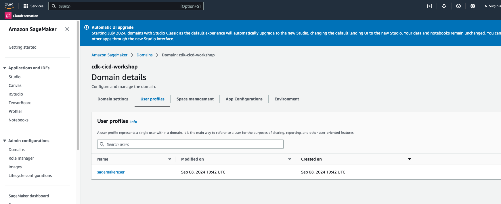

# Clean Up

Congratulations! You have successfully completed the workshop. You can now clean up the resources created in this workshop.

To clean up the resources, follow these steps:

## Step 1: Delete the CloudFormation Stacks

1. Delete all the CloudFormation stacks created during the workshop.
1.1. Ensure that you delete CDKToolkit stack at the last!!!
1.2. There are dependencies between the stacks, so you need to delete them in the reverse order of creation.

## Step 2: Delete the S3 Buckets

## Step 3: Delete the Amazon SageMaker Studio Domain

Open the Amazon SageMaker Studio.
{: class="workshop-image"}

Click on the `Domains`.
{: class="workshop-image"}

Select the `cdk-cicd-example` domain. Go to the Space management tab, select the `my-space` and click on the `Delete` button.
{: class="workshop-image"}

It will show a pop-up to confirm the deletion. Click on the `Yes, delete space` button, then type in the `delete` to the input field than click the `Delete space` button to delete the user space.
{: class="workshop-image"}

Then go to the `User profiles` tab.
{: class="workshop-image"}

Select the user profile and click on the `Delete` button.
{: class="workshop-image"}

There will be a pop-up to confirm the deletion. Click on the `Yes, delete user profile` button, then type in the `delete` to the input field than click the `Delete user profile` button to delete the user profile.

Then go to the `Domain settings` tab. Scroll down to the `Delete Domain` section. Click on the `Delete Domain` button.
{: class="workshop-image"}

There will be a pop-up to confirm the deletion. Click on the `Yes, delete my domain` button, then type in the `delete` to the input field than click the `Delete domain` button to delete the domain.