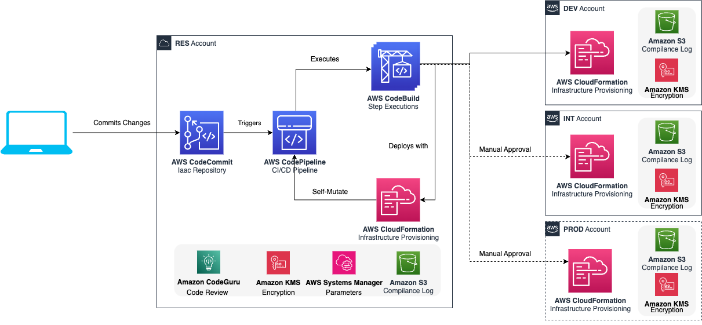

# Introduction & Overview

**Welcome, and thank you for joining us!**

We are excited to have you here to learn more about the **CDK CI/CD Wrapper**, a powerful tool designed to streamline your CI/CD processes using AWS CDK.

## Target Audience
This workshop is tailored for builders such as:

- Software Developers
- DevOps Engineers
- Cloud Engineers

You should have prior experience with AWS CDK and be familiar with developing or maintaining cloud applications using CDK.

- **Expected Completion Time**: 1.5 hours

## Background Knowledge
To successfully complete this workshop, it’s recommended that you have knowledge of the following:

- **TypeScript/JavaScript**
- **Basic Python**
- **Linux and Bash scripting**
- **Infrastructure-as-Code (IaC) with AWS CDK**

## What You Will Learn
In this workshop, we will guide you through the following steps:

1. **Creating a CDK Project & Bootstrapping the AWS Account**  
   Learn how to initiate and configure your AWS environment for CDK development.

2. **Defining Quality Gates and Continuous Integration**  
   Establish quality controls and build automation processes to ensure code quality and efficiency.

3. **Creating a Pipeline and Enabling GitOps**  
   Set up a CI/CD pipeline and integrate GitOps to streamline deployment workflows.

4. **Developing with Workbench**  
   Utilize the Workbench environment to accelerate development and testing workflows.

5. **Building a GenAI Solution**  
   Deliver a Generative AI solution from start to end, incorporating it into your CI/CD pipeline for seamless deployment.

6. **Putting Everything Together**  
   Combine all components to build a production-ready CI/CD pipeline that’s scalable and efficient.

## Architecture Overview

Before we dive in, here’s an architecture diagram of the CDK CI/CD Wrapper to ensure you’re familiar with the outcome.

The diagram illustrates how AWS services like CodeCommit, CodePipeline, and CloudFormation work together to automate the CI/CD process across different accounts, integrating security, compliance, and automation tools such as Amazon KMS, CodeGuru, and S3.

Click on start to begin the workshop.

<a href="00-prerequisites.html" class="md-button">Start</a>