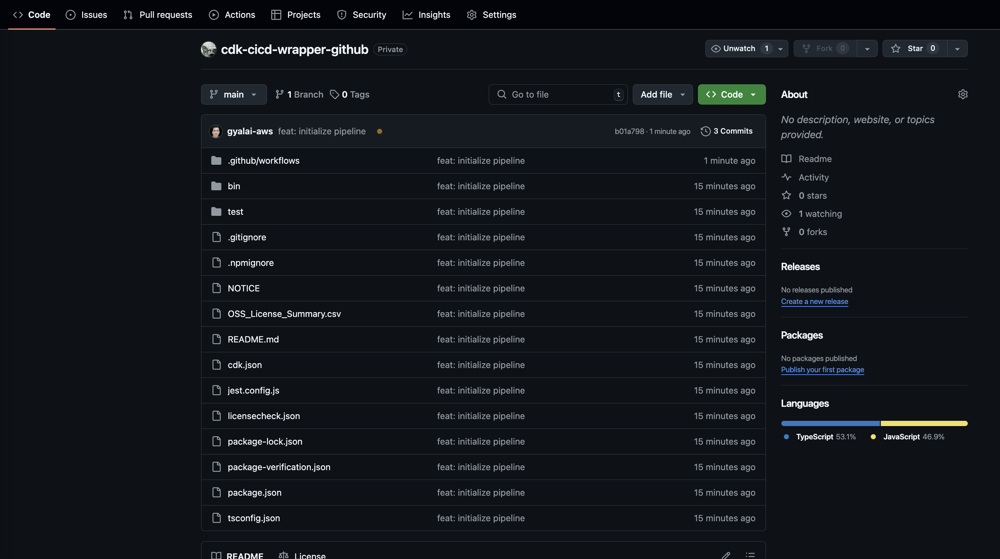
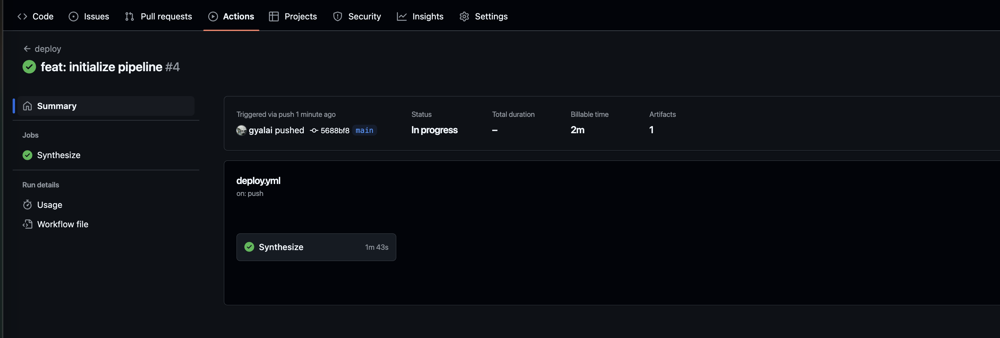
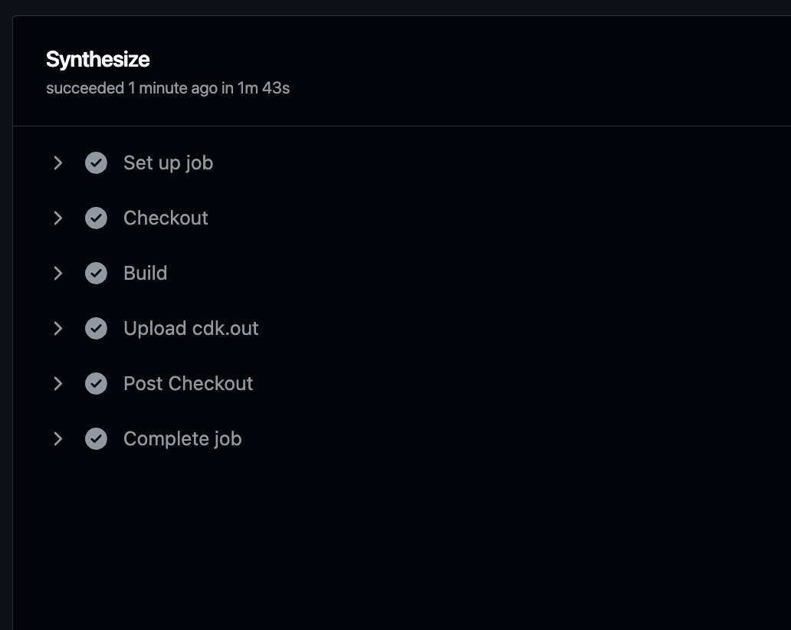

# Creating a Pipeline and Enabling GitOps

In this section, we are going to create the AWS CodePipeline and the required resources with the help of the CDK CI/CD Wrapper.

## Clean up the Example Stack

### Step 1: Open the Example File

First, open your `bin/cdk-cicd-wrapper-github.ts` file. It should look like this:

```typescript
--8<----
content/workshops/github-pipeline/assets/code/00-cdk-cicd-wrapper-github.ts
--8<----
```

### Step 2: Remove the Example Stack

Let’s remove the example stack by deleting the following blocks:

```typescript
import { CdkCicdWrapperGithubStack } from '../lib/cdk-cicd-wrapper-github-stack';
```

and

```typescript
new CdkCicdWrapperGithubStack(app, 'CdkCicdWrapperGithubStack', {
  /* Account/Region environment configuration */
});
```

### Step 3: Remove the unnecessary File

Delete the `lib/cdk-cicd-wrapper-github-stack.ts` file, as it’s no longer needed.

### Step 4: Verify the Clean Up

Your `bin/cdk-cicd-wrapper-github.ts` file should now look like this:

```typescript
--8<----
content/workshops/github-pipeline/assets/code/01-cdk-cicd-wrapper-github.ts
--8<----
```

## Create the Pipeline

### Step 5: Import the CDK CI/CD Wrapper

Now, let’s import the CDK CI/CD Wrapper. Add the following import statement after the `aws-cdk-lib` import:

```typescript
import * as wrapper from '@cdklabs/cdk-cicd-wrapper';
```

The updated `bin/cdk-cicd-wrapper-github.ts` file should now look like:

```typescript
#!/usr/bin/env node
import 'source-map-support/register';
import * as cdk from 'aws-cdk-lib';
import * as wrapper from '@cdklabs/cdk-cicd-wrapper';

const app = new cdk.App();
```

### Step 6: Define the Pipeline with Builder

Next, we will create the pipeline using the CDK CI/CD Wrapper. Before proceeding, you need to replace the placeholders in the code with your own AWS account ID and GitHub repository name.

1. Replace <your AWS account id> with your actual AWS account ID.

You can find your AWS account ID in the AWS Management Console by selecting My Account from the account dropdown (upper-right corner of the console).

<div class="note">You must use the explicit AWS account ID here. The usual environment variables such as <code>ACCOUNT_RES</code>, <code>ACCOUNT_DEV</code>, or <code>ACCOUNT_INT</code> cannot be used in this case.</div>

2. Replace <your GitHub repository> with the name of your GitHub repository.

This should be the repository name where you have your AWS CDK application. You can find this name directly in your GitHub repository's URL: https://github.com/<your-username>/<your-repository-name>.

```typescript
wrapper.PipelineBlueprint.builder()
  .region('eu-central-1')
  .defineStages([
    { stage: wrapper.Stage.RES, account: '<your AWS account id>' },
  ])
  .plugin(new wrapper.GitHubPipelinePlugin({
    repositoryName: '<your GitHub repository>',
  }))
  .synth(app);
```

> **Congratulations!** Your code is ready to deploy the pipeline.

??? "Show Solution"
    The `bin/cdk-cicd-wrapper-github.ts` file should look like this:
    ```typescript
    --8<----
    content/workshops/github-pipeline/assets/code/02-cdk-cicd-wrapper-github.ts
    --8<----
    ```

## Deploy the Pipeline

### Step 7: Verify the Code Can Be Synthesized

Run the following command to synthesize the pipeline:

```bash
npm run cdk synth
```

When you run this command, the pipeline will generate a .github folder in your project. This folder contains a GitHub Actions workflow that automates the deployment of your AWS CDK application.

The workflow includes steps to build, test, and synthesize your CDK code, ensuring it is ready for deployment. It triggers on every push to the main branch, using GitHub Actions to automatically deploy the application to your AWS environment. You can manually trigger the deployment or let it run automatically on code changes.

### Step 8: Set Up the AWS Side of the Pipeline

To deploy the AWS account-side components of the pipeline, run the following command:

```bash
npm run cdk deploy -- --all
```

During the deployment process, you will be prompted to review the AWS IAM policies that will be created. Once you've reviewed them, confirm by typing 'y'.

<div class="workshop-congrats-box"> <strong class="workshop-congrats-title">✓ Congratulations!</strong><br/> Your AWS account is now ready to interact with the GitHub repository.</div>

---

## (Optional) Review the Infrastructure

Let’s review the infrastructure that was deployed. Go to the **AWS CloudFormation** service and check the following stacks:

| Stack                                  | Description                                                                                            | Resources                           |
|----------------------------------------|--------------------------------------------------------------------------------------------------------|-------------------------------------|
| `cdk-cicd-wrapper-github`                     | The core stack containing the IAM Role and Policy to interact with the AWS accoutn from GitHub Actions. |                    |
| `cdk-cicd-wrapper-githubRepository`           | The core stack containing the IAM Role and Policy to interact with the AWS accoutn from GitHub Actions      |  |
| `cdk-cicd-wrapper-githubSSMParameterStack`    | AWS SSM Parameters for environment variable mirroring.                                                   | SSM Parameters                      |
| `cdk-cicd-wrapper-githubEncryptionStack`      | AWS KMS Key used for data encryption at rest.                                                            | KMS Key                             |
| `cdk-cicd-wrapper-githubComplianceLogBucket`       | This stack ensures that an Amazon S3 Bucket exists for logging.                                           | S3 Bucket                           |

---

## Enabling GitOps

Now that our repository and pipeline are in place, we can start pushing changes to the repository.

### Step 9: Add the GitHub repository as a remote

```bash
git remote add origin <GitHub repository clone url>
```

### Step 10: Commit and push the changes

```bash
git add .
git commit -m "feat: initialize pipeline"
git push -u origin main
```

After pushing the changes, you can check the repository in the AWS Management Console.

{: class="workshop-image"}

> **Congratulations!** Your changes have been committed and pushed to the repository.

## Observe the Pipeline

After pushing the changes to the repository, it's important to observe the progress of the pipeline in AWS CodePipeline to ensure everything is working as expected.

### Step 11: Access GitHub Actions

1. Navigate to your GitHub repository.

2. Click on the Actions tab at the top of the repository page.

{: class="workshop-image"}

3. In the CodePipeline dashboard, find the pipeline named `cdk-cicd-example` (or the name you've given your pipeline).

### Step 12: View Workflow Stages

1. Click on the deploy workflow to open its details.

2. You will see the different stages of the workflow, such as Checkout, Build, Test, and Synthesize.

### Step 13: Monitor the Workflow Execution

Each stage of the workflow will display its current status. You can monitor the progress of each steps in real-time.

- **Checkout Step:** This step retrieves the latest commit from your GitHub repository.
- **Build Step:** During this step, the workflow will run the commands defined in your npm scripts, compiling the code, running tests, ensuring the code quality, and AWS CDK to generate and prepare your CloudFormation templates for deployment
- **Upload Step:** Finally, the upload step uploads the cdk.out folder as artifact.

{: class="workshop-image"}

If the pipeline succeeds, all stages will be marked as Succeeded.

<div class="workshop-congrats-box">
  <strong class="workshop-congrats-title">✓ Congratulations!</strong><br/>
Your CI/CD pipeline is ready to be used.
</div>

Click **Next** to continue to the next section.

<a href="04-develop-genai-solution.html" class="md-button">Next</a>