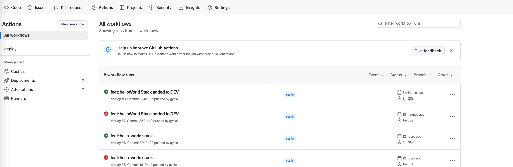

# Deploy stack with CDK CI/CD Wrapper

In this section, we’ll deploy our infrastructure stack using the **CDK CI/CD Wrapper** integrated with **GitHub Actions**. This will guide you through the process of creating an AWS infrastructure stack, integrating it into the pipeline, and deploying it across stages. The stack we are deploying is designed to be flexible, modular, and ready for deployment in multiple AWS accounts.

You will:

- Create an infrastructure stack (HelloWorldStack) in your CDK project.
- Extend the CDK pipeline with a **DEV stage** for deployment.
- Add and manage the stack using the **DefaultStackProvider**.
- Deploy and observe the CI/CD pipeline using GitHub Actions.

By the end of this section, you’ll have a complete understanding of how to define, manage, and deploy infrastructure using the CDK CI/CD Wrapper, powered by GitHub Actions for continuous integration and deployment.

## Create a Stack

### Step 1: Create the Infrastructure Stack

We’ll begin by defining our demo stack.

1. **Create a file** in `lib/hello-world-stack.ts` and add the following content:

```typescript
--8<----
content/workshops/github-pipeline/assets/code/00-hello-world-stack.ts
--8<----
```

> **Congratulations!** You’ve successfully created the infrastructure definition.

### Step 2: Extend the Pipeline with a DEV Stage

1. **Open** the `bin/cdk-cicd-wrapper-github.ts` file and modify the pipeline to add a DEV stage.
2. **Replace** the `.defineStages` block with the following:
    * Replace `<your AWS account id>` with your actual AWS account ID.

<div class="note">You can find your AWS account ID in the AWS Management Console by selecting My Account from the account dropdown (upper-right corner of the console).</div>

```typescript
.defineStages([
  { stage: wrapper.Stage.RES, account: '<your AWS account>' },
  { stage: wrapper.Stage.DEV, account: '<your AWS account>' },
])
```

> **Well done!** You’ve extended the pipeline to include a DEV stage.

## Update the Pipeline to Include the HelloWorldStack

This time, we will use the **DefaultStackProvider** class, which helps maintain cleaner and more manageable code.

### Step 3: Create the HelloWorldProvider Class

We’ll begin by creating a `bin/hello-world-provider.ts` file that will use the `DefaultStackProvider` class to provide the HelloWorldStack.

1. **Create** a file named `bin/hello-world-provider.ts`.
2. **Add** the following content to the file:

```typescript
--8<----
content/workshops/github-pipeline/assets/code/00-hello-world-provider.ts
--8<----
```

> **Congratulations!** You’ve successfully created the `HelloWorldProvider` class to manage the deployment of the `HelloWorldStack`.

### Step 4: Add the HelloWorldProvider to the Pipeline

Next, we will modify the `bin/cdk-cicd-wrapper-github.ts` file to include the **HelloWorldProvider**.

1. **Open** the `bin/cdk-cicd-wrapper-github.ts` file.
2. **Add** the following line to include the HelloWorldProvider class:

    ```typescript
    .addStack(new HelloWorldProvider())
    ```
3. **Import** the `HelloWorldProvider` class at the top of the file:

    ```typescript
    import { HelloWorldProvider } from './hello-world-provider';
    ```

> **Great work!** You’ve successfully updated the pipeline to include the **DemoProvider** class.

??? "Show Solution"
    The `bin/cdk-cicd-wrapper-github.ts` file should look like this:
    ```typescript
    --8<----
    content/workshops/github-pipeline/assets/code/03-cdk-cicd-wrapper-github.ts
    --8<----
    ```

### Step 5: Update the pipeline

Since we’ve defined a new stage (DEV) and introduced new AWS CDK stacks, it's essential to update the GitHub Actions pipeline to ensure that the new stack is correctly included in the deployment process. This allows the new HelloWorldStack to be synthesized and deployed across the pipeline stages. Without updating, the pipeline would not recognize the new infrastructure changes.

1. Run the following command to deploy the new stage:

    ```bash
    npm run cdk deploy -- --all
    ```

> **Great!** The DEV stage has been successfully deployed.


## Commit the changes

### Step 6: Commit and Push the Changes

1. **Run** the following commands to validate and commit the changes:

    ```bash
    git add .
    git commit -m "feat: helloWorld Stack added to DEV"
    git push
    ```

> **Congratulations!** You’ve successfully committed your changes and pushed them to the repository.

## Observe the Pipeline

After pushing the changes to the repository, it's important to observe the progress of the pipeline in GitHub Actions to ensure everything is working as expected.

### Step 7: Access GitHub Actions

1. Navigate to your **GitHub repository**.

2. Click on the Actions tab at the top of the repository page. This lists the executed workflows.

{: class="workshop-image"}


### Step 8: View Workflow Pipeline

1. Click on the `feat: helloWorld Stack added to DEV` workflow to open its details.

2. ### Step 8: View Workflow Pipeline


{: class="workshop-image"}

### Step 9: GitHub Environments

The **CDK CI/CD Wrapper** integrates seamlessly with GitHub’s **Environment** feature, allowing you to track and manage deployments to different stages (such as DEV, INT, and PROD) directly from your GitHub repository.

Your environments and their latest deployments are listed in the sidebar of your GitHub repository.


Your environments and latests deployments are listed on side bar of your repository.

1. Navigate to your **GitHub repository**.

{: class="workshop-image"}

2. Click on the DEV environment to review the deployment history and applied changes for this stage.

{: class="workshop-image"}

<div class="note">You may notice multiple entries connected to the same commit message. This is because we deployed multiple stacks (in this case, 5 stacks) to the DEV environment at the same time.</div>

### Step 10: Verify the Deployed Stack in AWS CloudFormation

1. Open your AWS account used for the DEV stage.

2. In the AWS Management Console, navigate to CloudFormation.

3. You will see that the HelloWorldStack has been successfully deployed to your account.

{: class="workshop-image"}

<div class="workshop-congrats-box">
  <strong class="workshop-congrats-title">✓ Congratulations!</strong><br/>
You've deployed the HelloWorldStack with the CDK CI/CD Wrapper
</div>


Click **Next** to continue to the next section.

<a href="05-summary.html" class="md-button md-button--primary" style="background: green; border: green;">Finish</a>
